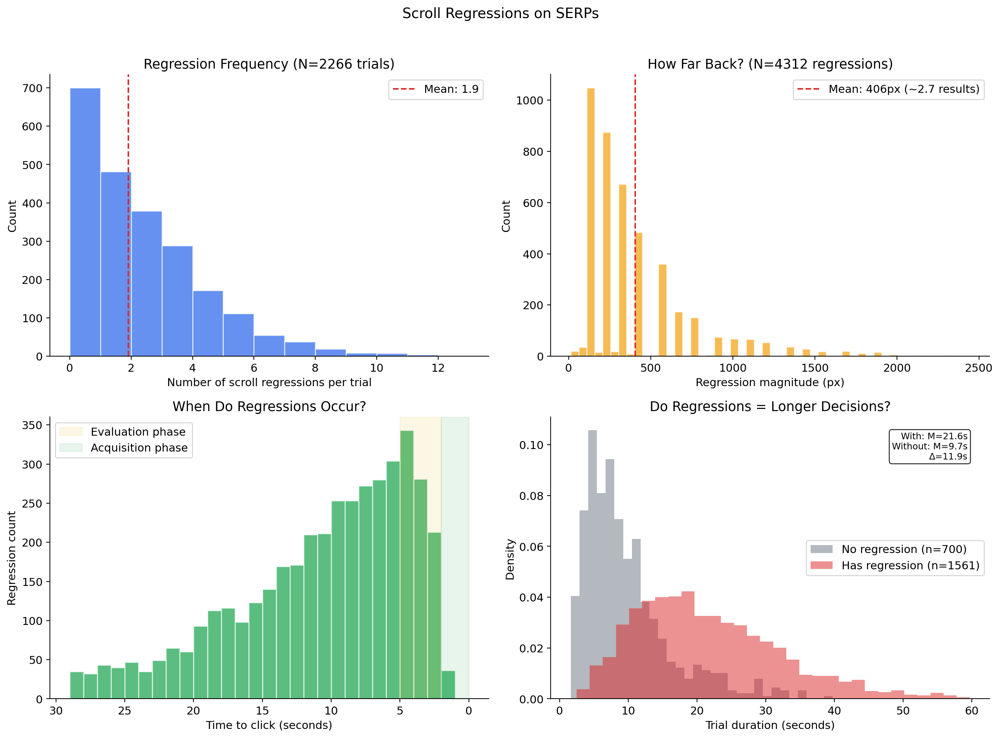
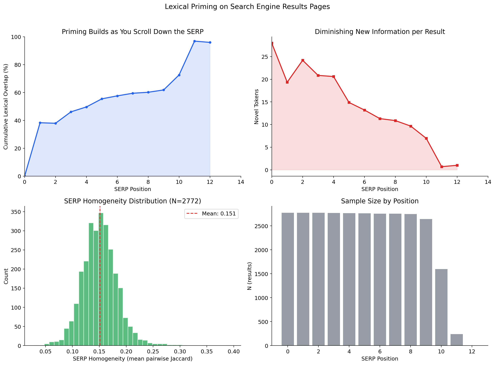

# Attentional Foraging on SERPs

A first-pass reanalysis of the [AdSERP dataset](https://github.com/kayhan-latifzadeh/AdSERP) (Latifzadeh, Gwizdka & Leiva, SIGIR 2025) — 2,776 transactional queries on Google SERPs with simultaneous eye tracking and mouse tracking from 47 participants.

> **v0 — 2026-04-01. This is a <4 hour first pass.**
>
> We found this dataset, got excited, and spent an afternoon exploring it. Three notebooks, preliminary findings, open questions. Shared early because the dataset is a gift and the questions are worth pursuing in the open.
>
> **Revision strategy:** The [journey doc](docs/journey.md) is frozen as of this release — it records the first session as it happened, including wrong turns and naive assumptions. Future work will add a "What we got wrong" section to the journey doc and update the [findings](docs/findings.md) as we learn more. The point is to show the full arc, not just the polished result.
>
> **Known validity gap:** Distance metrics use uncorrected screen-space coordinates. Fixation data is in page-space; mouse data is in screen-space. The scroll offset needed to reconcile them is available but not yet applied. Convergence trends are robust; absolute pixel values are approximate. See [findings caveats](docs/findings.md#caveats).

Built collaboratively by a human researcher and [Claude Code](https://claude.ai/claude-code). The [journey doc](docs/journey.md) is a transparent account of the process.

---

## Findings

Full writeup with caveats: **[docs/findings.md](docs/findings.md)**

### Mouse-gaze distance depends on click intent

The reported 372px aggregate mixes two regimes. Before ~10s, the click target is often not in the viewport — the distance metric is abstract. In the last 10s, distance drops monotonically as the mouse converges on the visible target.


### Eye movements coordinate scrolling

Viewport state — whether the target is visible, how recently the user scrolled — predicts clicks better than mouse-gaze distance alone (AUC 0.704 vs 0.631).


### Scroll regressions are the dominant pattern

69% of trials involve scrolling back up to re-examine previous results. This page-level analog of fixation regressions in reading appears undercharacterized relative to its prevalence.



### Lexical overlap builds rapidly

By position 9, 62% of a result's vocabulary has already appeared in prior results. Whether this priming mediates evaluation speed — the alternative to the "declining effort" explanation — is our most interesting open question.



---

## Notebooks

| Notebook | nbviewer | Topic |
|----------|----------|-------|
| **Convergence** | [View](https://nbviewer.org/github/andyed/attentional-foraging/blob/main/convergence_analysis.ipynb) | Mouse-gaze distance conditioned on click intent, scroll-enriched prediction |
| **Regressions** | [View](https://nbviewer.org/github/andyed/attentional-foraging/blob/main/scroll_regressions.ipynb) | Scroll regression prevalence, magnitude, timing, sparklines |
| **Priming** | [View](https://nbviewer.org/github/andyed/attentional-foraging/blob/main/serp_priming.ipynb) | Cumulative lexical overlap, SERP homogeneity, regression linkage |

## Data

Behavioral data (~15MB) from [Zenodo](https://zenodo.org/records/15236546). SERP HTML (~535MB) needed for notebook 3 only.

```bash
cd AdSERP/data
curl -L -o fixation-data.zip "https://zenodo.org/records/15236546/files/fixation-data.zip?download=1"
curl -L -o mouse-movement-data.zip "https://zenodo.org/records/15236546/files/mouse-movement-data.zip?download=1"
curl -L -o trial-metadata.zip "https://zenodo.org/records/15236546/files/trial-metadata.zip?download=1"
unzip -q fixation-data.zip && unzip -q mouse-movement-data.zip && unzip -q trial-metadata.zip

# For notebook 3:
curl -L -o serps.zip "https://zenodo.org/records/15236546/files/serps.zip?download=1"
unzip -q serps.zip
```

```bash
uv sync && uv run jupyter execute convergence_analysis.ipynb --inplace
```

## Docs

- **[findings.md](docs/findings.md)** — What we think we found, with caveats
- **[journey.md](docs/journey.md)** — How the session unfolded, frozen at v0
- **[adserp-key-claims.md](docs/adserp-key-claims.md)** — The original paper's claims and what the dataset enables beyond them

<a id="whats-next"></a>
## What's Next

- **Coordinate correction (priority):** Reconcile page-space fixations with screen-space mouse using scroll offset
- **Per-result priming → evaluation speed:** Link lexical overlap to fixation duration per result
- **Local novelty → regression triggers:** Does a single novel result cause the user to scroll back?
- **Pupil dilation × regressions:** Cognitive load/surprise signal
- **Citation audit:** Verify our claims about what has/hasn't been studied

## Citation

Please cite the original dataset:

```
Latifzadeh, K., Gwizdka, J., & Leiva, L. A. (2025).
A Versatile Dataset of Mouse and Eye Movements on Search Engine Results Pages.
Proc. 48th ACM SIGIR Conference, 3412-3421.
https://doi.org/10.1145/3726302.3730325
```

## License

Analysis code: MIT. The AdSERP dataset has its own [license](https://github.com/kayhan-latifzadeh/AdSERP/blob/main/LICENSE).
