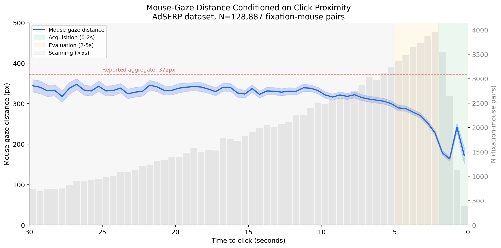
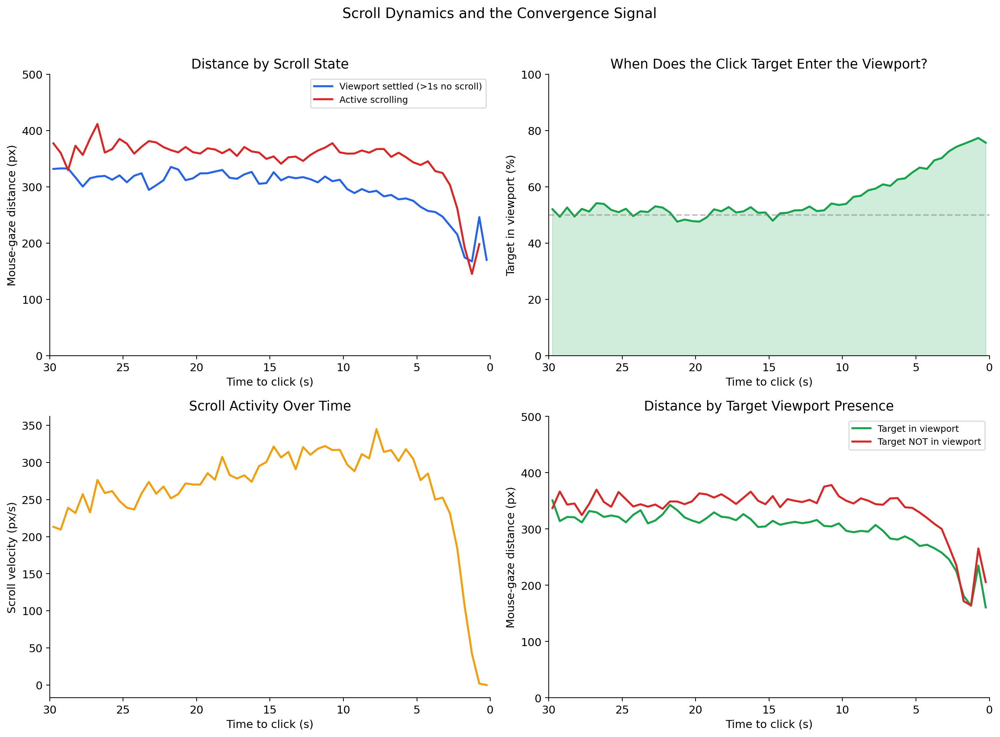
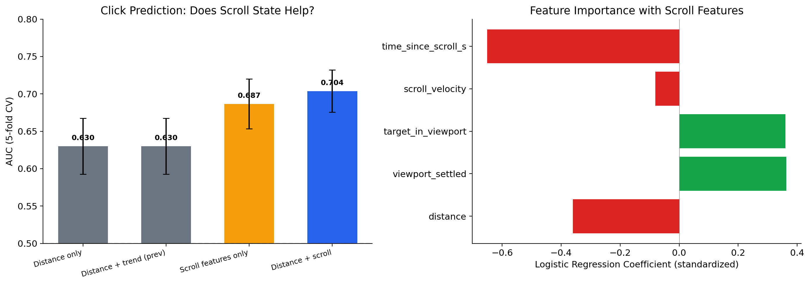
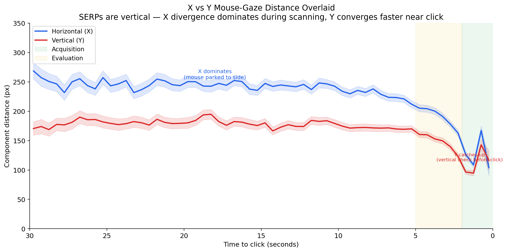
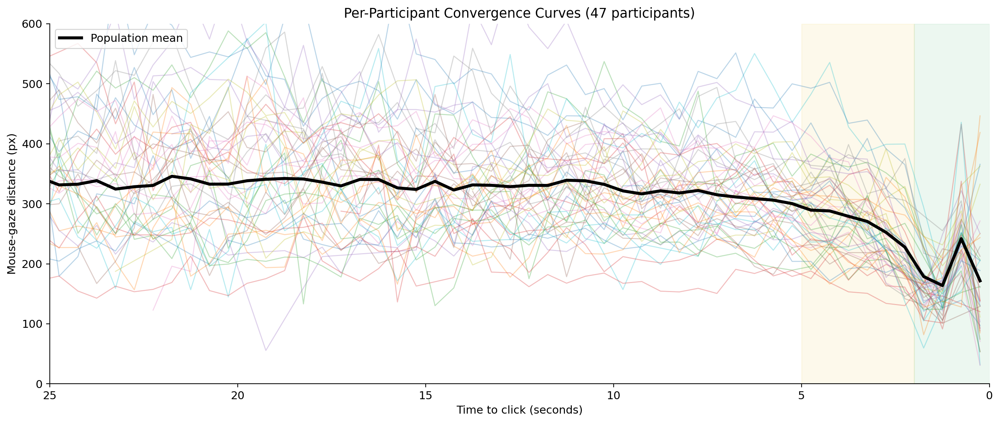
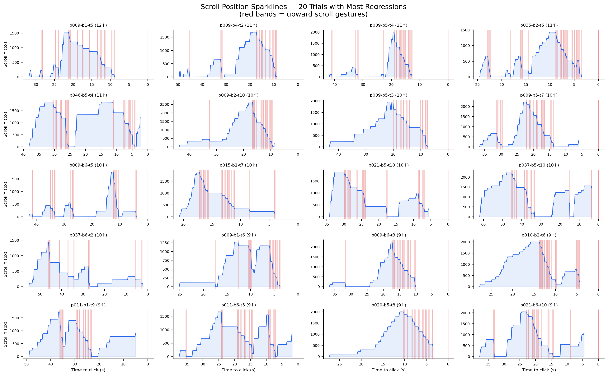
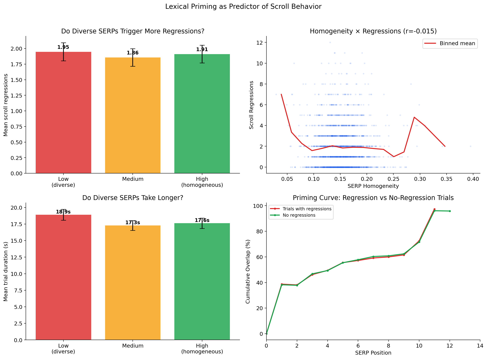

# Attentional Foraging on SERPs

> **v0 — Proof of concept. Released 2026-04-01 at 08:00 PT.**
>
> This entire analysis — dataset discovery to three notebooks, 17 plots, and this README — was produced in a single session of under 3 hours by a human researcher (cognitive psychologist, HCI) and [Claude Code](https://claude.ai/claude-code) (Anthropic's AI coding agent). The [journey doc](docs/journey.md) is a full transparent account. We're sharing early because the questions are interesting and the dataset deserves more attention.
>
> **Known validity gap:** The distance metrics in Notebook 1 use **uncorrected screen-space coordinates**. Fixation data is in page-space (gaze Y extends beyond screen height during scrolling) while mouse data is in screen-space. The scroll offset needed to reconcile them is available in the data but not yet applied. This means the absolute distance values (334px, 172px, etc.) are approximate. The *relative* trends (convergence shape, phase structure, scroll-state conditioning) are robust because the coordinate mismatch is roughly constant within scroll states — but the numbers should not be cited as precise measurements until the correction is applied. See [What's Next](#whats-next).

Reanalysis of the [AdSERP dataset](https://github.com/kayhan-latifzadeh/AdSERP) (Latifzadeh, Gwizdka & Leiva, SIGIR 2025) — 2,776 transactional queries on Google SERPs with simultaneous eye tracking + mouse tracking from 47 participants.

---

## The Core Argument

The widely reported mouse-gaze distance (~372px in AdSERP) has never been conditioned on **click intent**. We show this aggregate hides two distinct regimes:

**Before ~10s to click**, the click target is in the viewport only ~50% of the time — essentially chance. "Distance to target" is measuring distance to something often *not on screen*. It's an abstract distance-to-goal metric, not a spatial-motor signal.

**After ~10s**, the target enters the viewport, and mouse-gaze distance becomes spatially meaningful. Three phases emerge:



*128,887 fixation-mouse pairs across 2,762 trials. Distance drops from ~330px (scanning) to ~172px (acquisition). The red dashed line is the aggregate reported in the paper — it sits above the scanning baseline because it pools high- and low-intent fixations. **Caveat:** These distances use uncorrected screen-space coordinates; see validity note above. The convergence trend is robust but absolute pixel values are approximate.*

---

## Scroll-stop is the real predictor

The convergence signal is downstream of a viewport event. When the viewport is settled (no scroll for >1s), distance shows a clean convergence ramp. During active scrolling, distance stays high and flat.



*Top-left: Distance by scroll state. Top-right: The critical chart — target enters viewport at above-chance rates only in the last ~10s. Bottom-left: Scroll velocity drops to zero before click. Bottom-right: Distance conditioned on whether the target is visible.*

Adding viewport state to a logistic regression boosted click prediction AUC from 0.631 to **0.704** — a larger gain than all other features combined:



---

## X and Y tell different stories

SERPs are vertical layouts. During scanning, the mouse parks *horizontally* offset from gaze (X divergence dominates). Near click, the vertical component catches up as the eye does a final vertical check before committing.



---

## Per-participant convergence varies wildly

Acquisition onset ranges from 0.2s to 13.8s across participants (mean=2.4s, SD=2.5s). Per-session calibration is warranted.



---

## Scroll regressions are the norm

69% of SERP trials involve scrolling back up to re-examine previously viewed results. This page-level behavior — analogous to fixation regressions in reading — is barely characterized in the literature despite being the dominant browsing pattern.


*Top-left: Most trials have 1-3 regressions. Top-right: Mean regression magnitude is ~400px (~2.7 result slots). Bottom-left: Regressions cluster in the middle of the trial (evaluation phase). Bottom-right: Trials with regressions take 11.9s longer.*

Individual scroll position traces reveal a characteristic "mountain" pattern — scroll down, peak, scroll back up, settle, click:



---

## Acceleration down the SERP is priming, not fatigue

Users evaluate results faster as they scroll down. The standard interpretation is declining effort or attention. We show cumulative lexical overlap rises steeply — by position 9, 62% of a result's vocabulary has already appeared in prior results. Novel tokens per result drop from 28 to 10.


*Top-left: Cumulative overlap builds rapidly. Top-right: Diminishing new information per result. Bottom-left: SERP homogeneity distribution. Bottom-right: Sample size stays strong through position 9.*

SERP-level homogeneity doesn't predict regressions (r=-0.015). Regressions are likely triggered by **local novelty events** — a single result that breaks the pattern — not by overall page diversity. This per-result analysis is next.



---

## Notebooks

| Notebook | nbviewer | Key finding |
|----------|----------|-------------|
| **1. Mouse-Gaze Convergence** | [View](https://nbviewer.org/github/andyed/attentional-foraging/blob/main/convergence_analysis.ipynb) | Distance drops 48% as click approaches. Scroll viewport state (AUC=0.704) beats raw distance (0.631) for click prediction. |
| **2. Scroll Regressions** | [View](https://nbviewer.org/github/andyed/attentional-foraging/blob/main/scroll_regressions.ipynb) | 69.1% of trials have regressions. Mean 2.8/trial, 1,118px magnitude. Correlates with decision time (r=0.660). |
| **3. Lexical Priming** | [View](https://nbviewer.org/github/andyed/attentional-foraging/blob/main/serp_priming.ipynb) | Cumulative overlap reaches 62% by position 9. Novel tokens drop from 28→10. Global homogeneity doesn't predict regressions. |

## How this was made

This analysis was produced in a single collaborative session between a human researcher and [Claude Code](https://claude.ai/claude-code). The full narrative — including what broke, what surprised us, and the back-and-forth that shaped the research questions — is in [docs/journey.md](docs/journey.md). The [key-claims analysis](docs/adserp-key-claims.md) documents the theoretical gaps we found in the original paper.

The human brought domain expertise (cognitive psychology, HCI, 20 years in applied research at eBay/Adobe/Meta/Quora), the hypothesis (p(click) conditioning), and the critical reframes (viewport as the real signal, priming not fatigue, scroll regressions as decision signal). The AI brought speed — data wrangling, 17 plots, three notebooks, statistical analysis, and literature synthesis in under 3 hours.

Neither could have done this alone in this timeframe.

## Data

Behavioral data (~15MB) downloads from [Zenodo](https://zenodo.org/records/15236546). SERP HTML (~535MB) needed for notebook 3 only.

```bash
cd AdSERP/data
# Required for notebooks 1 & 2:
curl -L -o fixation-data.zip "https://zenodo.org/records/15236546/files/fixation-data.zip?download=1"
curl -L -o mouse-movement-data.zip "https://zenodo.org/records/15236546/files/mouse-movement-data.zip?download=1"
curl -L -o trial-metadata.zip "https://zenodo.org/records/15236546/files/trial-metadata.zip?download=1"
unzip -q fixation-data.zip && unzip -q mouse-movement-data.zip && unzip -q trial-metadata.zip

# Required for notebook 3 (lexical priming):
curl -L -o serps.zip "https://zenodo.org/records/15236546/files/serps.zip?download=1"
unzip -q serps.zip
```

## Setup

```bash
uv sync   # installs Python deps from pyproject.toml
uv run jupyter execute convergence_analysis.ipynb --inplace
uv run jupyter execute scroll_regressions.ipynb --inplace
uv run jupyter execute serp_priming.ipynb --inplace
```

<a id="whats-next"></a>
## What's Next

- **Coordinate correction (priority):** Reconcile page-space fixation coordinates with screen-space mouse coordinates using scroll offset. This will produce accurate distance values and may sharpen the convergence signal in the 5-10s window.
- Per-result novelty → regression trigger analysis
- Pupil dilation × scroll regressions (cognitive load/surprise signal)
- Fixation-to-result mapping via ad bounding boxes
- Foveated replay on SERP scanpaths via [Scrutinizer](https://github.com/andyed/scrutinizer-www)

## Citation

If you use this analysis, please cite both this repository and the original dataset:

```
Latifzadeh, K., Gwizdka, J., & Leiva, L. A. (2025).
A Versatile Dataset of Mouse and Eye Movements on Search Engine Results Pages.
Proc. 48th ACM SIGIR Conference, 3412-3421.
https://doi.org/10.1145/3726302.3730325
```

## License

Analysis code: MIT. The AdSERP dataset has its own [license](https://github.com/kayhan-latifzadeh/AdSERP/blob/main/LICENSE).
