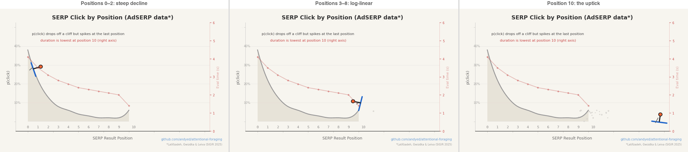
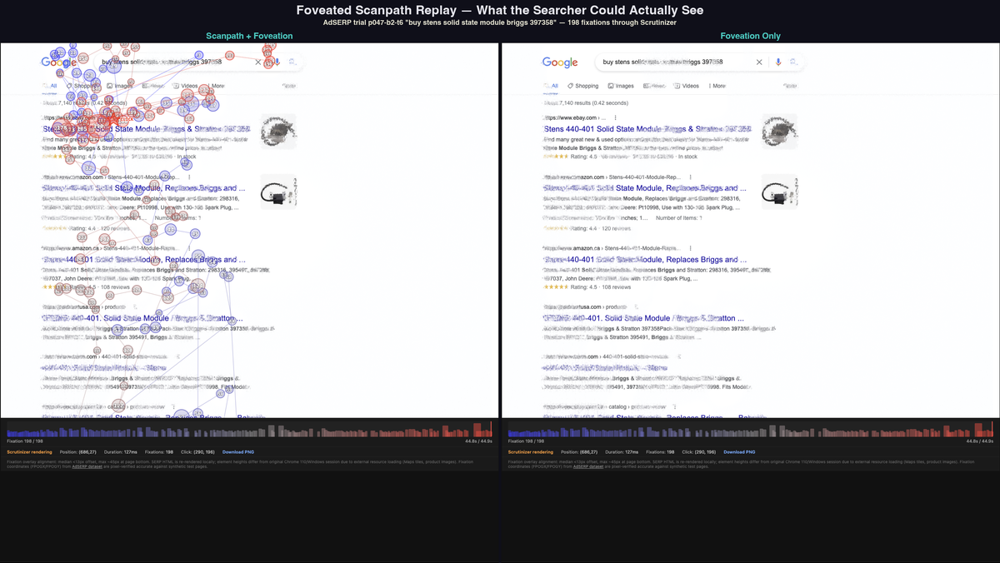
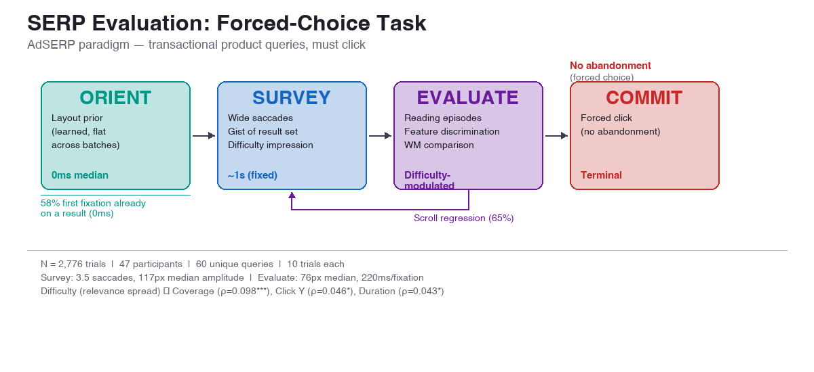

# Attentional Foraging on SERPs

[Demo](https://andyed.github.io/attentional-foraging/) | [Task Model](#the-task-model) | [Key Insights](#key-insights) | [Notebooks](#notebooks) | [Data](#data) | [Paper](#paper) | [What's Next](#whats-next)

---

Two decades of building search and recommendation systems at eBay, Microsoft, Meta, and Quora produced two observations that needed explanation:

**The ski-jump.** Click share drops from position 1 to ~8, then upticks at the boundary — the last result before "next page." Every search engine sees this. It's attributed to "position bias," which is a label, not an explanation. AdSERP replicates it: position 10 deviates 39% above the log-linear trend from positions 5–9 (χ² = 10.0, p = 0.0015), with the forced-choice task boundary replacing the pagination boundary.

| Pos | 0 | 1 | 2 | 3 | 4 | 5 | 6 | 7 | 8 | 9 | **10** |
| --- | --- | --- | --- | --- | --- | --- | --- | --- | --- | --- | --- |
| Click % | 17.7 | 13.5 | 14.2 | 13.4 | 9.5 | 6.6 | 5.7 | 3.8 | 3.8 | 2.9 | **3.3** |

[](https://github.com/andyed/attentional-foraging/blob/main/notebooks-v2/00_skijump.ipynb)

→ [Ski-jump notebook](https://github.com/andyed/attentional-foraging/blob/main/notebooks-v2/00_skijump.ipynb) — decomposition by user strategy, LHIPA, difficulty

**The priming conjecture.** By position 5, 55% of a result's tokens have already appeared. Maybe evaluation speeds up from lexical priming, not declining effort. ([CHIIR 2021 workshop talk](https://www.linkedin.com/in/andyed/).)

Both turned out to need the same thing: decomposing SERP evaluation into measurable cognitive phases rather than treating it as a single process. [Latifzadeh, Gwizdka & Leiva's AdSERP dataset](https://github.com/kayhan-latifzadeh/AdSERP) (SIGIR 2025) — one of the richest public datasets of search behavior, with simultaneous eye tracking, mouse, scroll, and pupil data — made this possible. An AI-assisted [journey.md](./docs/journey.md) validated the dataset's utility; the [findings.md](./docs/findings.md) have been growing since.

## Interactive foveated scanpath replays

[**andyed.github.io/attentional-foraging**](https://andyed.github.io/attentional-foraging/) — 10 curated search sessions replayed through [Scrutinizer](https://github.com/andyed/scrutinizer2025)'s foveated vision pipeline. What each participant could actually resolve at each fixation: sharp where they looked, degraded where they didn't. Scanpath overlay, timeline scrubbing, playback, gaze point toggle.

[](assets/scanpath-sidebyside.png)

---

## The Task Model

### The general model

In naturalistic search, SERP evaluation is a loop with multiple exit paths:

```
Orient → Survey → Evaluate ─┬─→ Click (commit to a result)
                  ↑          ├─→ Next page / Reformulate (the SERP wasn't good enough)
                  └──────────┘   └─→ Abandon (the task wasn't worth it)
                  (regression)
```

The user enters with a query and a layout prior. They survey the result set (gist sampling), evaluate individual results (committed reading), and exit through one of three paths: click a result, seek more results (page 2, reformulated query), or abandon the search entirely. Regressions loop back from evaluate to re-survey. The decision between these exits — stay, refine, or quit — is the core foraging decision, and it's shaped by the impression formed during the survey phase.

### What we can measure: the AdSERP forced-choice task

AdSERP eliminates two of the three exit paths. Participants *must* click a result — no next page, no reformulation, no abandonment. This isolates the orient–survey–evaluate–commit sequence and makes the foraging-to-exploitation transition directly observable.



| Phase | Duration | Key observable |
| --- | --- | --- |
| **Orient** | 0ms (learned) | 58% of first fixations land directly on a result |
| **Survey** | ~1s, fixed | Wide saccades (117px), gist sampling ~3.5 results |
| **Evaluate** | Variable | Narrow saccades (76px), reading episodes (~2 fix, ~500ms) |
| **Commit** | Terminal | Click (forced in this task) |

Survey → evaluate transition: saccade amplitude drop, p = 10⁻⁶¹ within individual trials. Survey ends at fixation ~3; first scroll at fixation ~20 — decoupled events. Full model with evidence: [task-model-paper.pdf](./docs/arxiv/task-model-paper.pdf).

**What we can't test here:** the stay/refine/abandon decision — the core foraging choice in production search. The forced-choice constraint means every trial ends with a click, inflating regression rates (65% of trials) and eliminating the abandonment signal entirely. Validating the full model requires production log data with natural stopping behavior.

---

## Key Insights

Detailed write-up with all statistical tests: [findings.md](./docs/findings.md).

### Decomposition

- **The ski-jump is allocation, not speed.** Forward-pass reading depth is constant (~2 fixations, ~500ms per episode at every position). What declines is how many episodes each result gets. The position effect is a revisitation decision, not a reading depth change. → [§3e](docs/findings.md#3e-forward-pass-reading-depth-is-constant-the-position-effect-is-revisitation)
- **Forward-only dwell \*increases\* with position** (ρ = +0.82). Later results take longer per unit of committed evaluation — working memory load from holding more candidates. → [§3a](docs/findings.md#3a-evaluation-time-decomposes-into-four-independent-components)
- **Survey duration is content-independent.** ~3.5 saccades, ~1s, no correlation with any difficulty measure. The survey's *output* modulates strategy, not its duration.

### Priming (null)

- **Priming is null at result level.** Bag-of-words, semantic embeddings, within-position controls — all null. The aggregate correlation was a position-overlap confound. → [§2](docs/findings.md#2-cumulative-content-overlap-does-not-predict-evaluation-speed)
- **p(fixate) is also null.** Forward-only, users fixate everything (~99.8%). No skip decision for overlap to predict. → [§2a](docs/findings.md#2a-pfixate--visible-is-also-null--and-structurally-uninformative-for-forward-scanning)

### Difficulty

- **Difficulty is discriminability, not similarity.** Token overlap and embedding similarity between results don't predict behavior. *Relevance spread* (variance in query-result alignment) does: coverage ρ = 0.098, click position ρ = 0.046, duration ρ = 0.043, all within-participant.
- **Reading episodes respond to difficulty.** Minor-saccade pooling reveals 49.5% of result encounters are multi-fixation (mean 2.16 fix, 499ms). Higher on hard SERPs (p = 0.004).

### Behavioral signals

- **Viewport state beats mouse-gaze distance** for click prediction. AUC 0.704 vs 0.548. Scroll-stop is the signal. → [§6](docs/findings.md#6-viewport-state-predicts-clicks-better-than-distance)
- **Mouse proximity reveals the consideration set.** 26.9% click rate at <66px cursor-gaze distance vs 2.4% baseline. 14% of non-clicked results were deeply evaluated with cursor nearby. Deployable from mouse telemetry. → [§10](docs/findings.md#10-mouse-proximity-predicts-click--and-reveals-the-consideration-set)
- **Backward scrolling is ballistic** (ρ = 0.867). 87% of regression targets at positions 0–4. Regression velocity mediates the dwell delta. → [§8](docs/findings.md#8-backward-scrolling-is-ballistic--the-viewport-mechanics-confound)
- **LHIPA validates against behavior.** Pupillometric cognitive load monotonic with foraging depth (ρ = −0.90 with click position). → [§5 LHIPA notebook](https://github.com/andyed/attentional-foraging/blob/main/notebooks-v2/05_lhipa.ipynb)
- **Per-position cognitive load declines, not increases.** Butterworth LF/HF ratio (Duchowski 2026) peaks at position 0 and drops through positions 0–3, then plateaus (ρ = −0.618). Users build evaluation criteria at the first result, then apply them efficiently — framework compilation, not working memory overload. → [§3b-iv](docs/findings.md#3b-iv-per-position-cognitive-load-decreases-not-increases--framework-compilation-not-working-memory-overload)

### Individual differences

- **Two independent dimensions.** Deliberation style (regression rate, TTI, LHIPA) and motor coupling (gaze-cursor lag, split-half r = 0.76). Neither predicts the other. → [§11](docs/findings.md#11-two-orthogonal-individual-difference-dimensions)

---

## Dataset

[AdSERP](https://github.com/kayhan-latifzadeh/AdSERP) ([paper](https://doi.org/10.1145/3726302.3730325), [Zenodo](https://zenodo.org/records/15236546)) — Latifzadeh, Gwizdka & Leiva, SIGIR 2025. 2,776 transactional product queries, 47 participants, simultaneous eye tracking (Gazepoint GP3 HD, 150 Hz), mouse, scroll, pupil, SERP HTML snapshots, ad bounding boxes.

## Notebooks

`notebooks-v2/` with shared [data_loader.py](./notebooks-v2/data_loader.py). Numbered to match paper sections.

| # | Notebook | Topic |
| --- | --- | --- |
| 00 | [skijump](https://github.com/andyed/attentional-foraging/blob/main/notebooks-v2/00_skijump.ipynb) | Click distribution by position, boundary uptick, LHIPA, satisficer/optimizer split |
| 01 | [convergence](https://github.com/andyed/attentional-foraging/blob/main/notebooks-v2/01_convergence.ipynb) | Mouse-gaze distance, scroll-enriched click prediction |
| 02 | [gaze_cursor_lag](https://github.com/andyed/attentional-foraging/blob/main/notebooks-v2/02_gaze_cursor_lag.ipynb) | Temporal lag, split-half reliability |
| 03 | [early_predictors](https://github.com/andyed/attentional-foraging/blob/main/notebooks-v2/03_early_predictors.ipynb) | Early-trial signals of click target |
| 04 | [fixation_coverage](https://github.com/andyed/attentional-foraging/blob/main/notebooks-v2/04_fixation_coverage.ipynb) | Coverage, TTI, decomposition |
| 05 | [lhipa](https://github.com/andyed/attentional-foraging/blob/main/notebooks-v2/05_lhipa.ipynb) | Pupillometric cognitive load validation |
| 06 | [orientation_evaluation](https://github.com/andyed/attentional-foraging/blob/main/notebooks-v2/06_orientation_evaluation.ipynb) | Cognitive phases, working memory ramp |
| 07a–c | [regressions](https://github.com/andyed/attentional-foraging/blob/main/notebooks-v2/07a_regressions_prevalence.ipynb) | Prevalence, triggers, kinematics |
| 08 | [priming](https://github.com/andyed/attentional-foraging/blob/main/notebooks-v2/08_priming.ipynb) | Lexical priming — null at three granularities |
| 09 | [difficulty](https://github.com/andyed/attentional-foraging/blob/main/notebooks-v2/09_difficulty.ipynb) | Relevance spread, episodes, TF-IDF density |
| 10 | [strategies](https://github.com/andyed/attentional-foraging/blob/main/notebooks-v2/10_strategies.ipynb) | Satisfice vs optimize segmentation |
| 11 | [individual_differences](https://github.com/andyed/attentional-foraging/blob/main/notebooks-v2/11_individual_differences.ipynb) | Two independent trait dimensions |
| 12 | [regression_precision](https://github.com/andyed/attentional-foraging/blob/main/notebooks-v2/12_regression_precision_by_load.ipynb) | Regression targeting precision by cognitive load |
| 13 | [survey_phase](https://github.com/andyed/attentional-foraging/blob/main/notebooks-v2/13_survey_phase.ipynb) | Saccade amplitude evidence for the survey phase |
| 14 | [butterworth_cognitive_load](https://github.com/andyed/attentional-foraging/blob/main/notebooks-v2/14_butterworth_cognitive_load.ipynb) | Per-position Butterworth LF/HF cognitive load (Duchowski 2026) |
| 15 | [cursor_approach](https://github.com/andyed/attentional-foraging/blob/main/notebooks-v2/15_cursor_approach.ipynb) | Cursor approach-retreat as covert evaluation signal |
| 16 | [element_type](https://github.com/andyed/attentional-foraging/blob/main/notebooks-v2/16_element_type.ipynb) | Fixation, pupil, saccade by ad/organic element type |
| 17 | [scroll_retreat](https://github.com/andyed/attentional-foraging/blob/main/notebooks-v2/17_scroll_retreat.ipynb) | Scroll kinematics during regression — desktop null result |

Legacy notebooks in `notebooks/`.

## Reusable components

Several pieces of this project are designed for reuse beyond AdSERP:

| Component | Location | What it does |
| --- | --- | --- |
| **Shared data loader** | [data_loader.py](./notebooks-v2/data_loader.py) | Trial loading, scroll interpolation, result band estimation, SERP text extraction, fixation-to-position mapping. Eliminates per-notebook boilerplate. |
| **LHIPA computation** | [05_lhipa.ipynb](./notebooks-v2/05_lhipa.ipynb) | Duchowski et al. 2020 pupillometric cognitive load index, validated against behavioral measures on AdSERP. Reusable on any Gazepoint GP3 pupil stream. |
| **Reading episode pooling** | [09_difficulty.ipynb](./notebooks-v2/09_difficulty.ipynb) | Merges consecutive same-result fixations connected by minor saccades (<100px) into reading episodes. Recovers ~866ms/trial of parafoveal processing time invisible to raw FPOGD summation. Threshold is principled but needs sensitivity analysis. |
| **Relevance spread** | [compute_difficulty_measures.py](./scripts/compute_difficulty_measures.py) | SERP difficulty via embedding-based query-result alignment variance. Requires local embedding server (mxbai-embed-large on port 8890). Also computes TF-IDF distinctive density. |
| **Saccade phase detection** | Survey→evaluate transition via sliding-window amplitude threshold. Not yet extracted into a standalone function — currently inline in analysis code. |
| **Foveated scanpath replay** | [`site/`](https://andyed.github.io/attentional-foraging/) + [build-gh-pages.js](./scripts/build-gh-pages.js) | SVG scanpath overlay on Scrutinizer foveated renders. Playback, timeline scrubbing, gaze toggle. Self-contained HTML per trial. |

## Paper

[task-model-paper.pdf](./docs/arxiv/task-model-paper.pdf) — Orient–Survey–Evaluate–Commit: A Cognitive Task Model for SERP Evaluation. Pre-submission draft, target CHIIR 2027 or SIGIR resource track.

## Docs

- [findings.md](./docs/findings.md) — All findings with statistical tests (v7)
- [CHANGELOG.md](./CHANGELOG.md) — Version history and corrections
- [references.bib](./references.bib) — Verified BibTeX library
- [journey.md](./docs/journey.md) — The first session, frozen at v0

<a id="whats-next"></a>
## What's Next

Highlights from the full [TODO.md](./TODO.md):

- **Saliency-guided survey** — do survey saccades target visually salient SERP regions? Requires Scrutinizer saliency export ([spec-saliency-export-cli.md](./../scrutinizer-repo/scrutinizer2025/docs/spec-saliency-export-cli.md))
- **Product taxonomy partition** — commodity vs branded vs experiential queries may have different foraging strategies and difficulty structures
- **Full model validation** — the stay/refine/abandon decision needs production log data with natural stopping
- **Windowed LHIPA by position** — pupil dilation during forward scanning as a cognitive load trajectory (pending Duchowski consultation on minimum window size)
- **Token-level fixation analysis** — the only untested priming granularity (word-level AOI mapping against SERP HTML)

## Citation

```
Latifzadeh, K., Gwizdka, J., & Leiva, L. A. (2025).
A Versatile Dataset of Mouse and Eye Movements on Search Engine Results Pages.
Proc. 48th ACM SIGIR Conference, 3412-3421.
https://doi.org/10.1145/3726302.3730325
```

## License

Analysis code: MIT. The AdSERP dataset has its own [license](https://github.com/kayhan-latifzadeh/AdSERP/blob/main/LICENSE).
