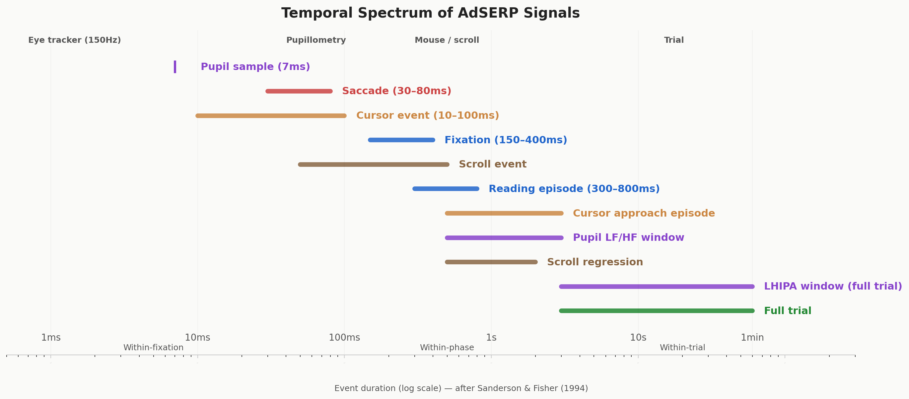
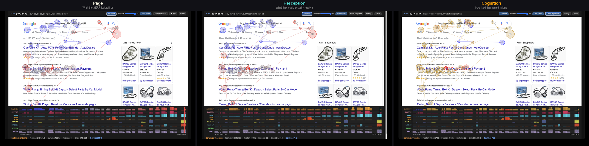
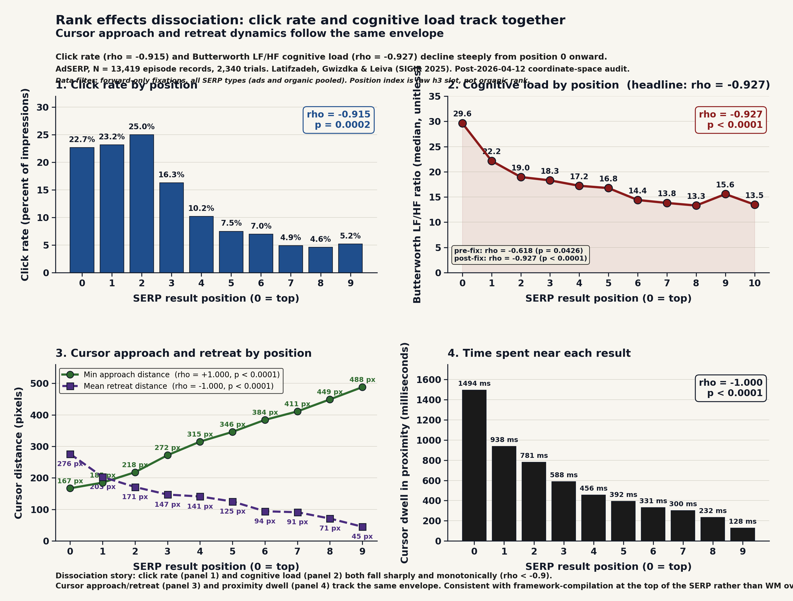

# Attentional Foraging on Search Results Pages

[Demo](https://andyed.github.io/attentional-foraging/) | [Why a task model](#why-a-task-model-not-another-classifier) | [Task Model](#the-task-model) | [Key Insights](#key-insights) | [Notebooks](#notebooks) | [Data](#data) | [Paper](#paper) | [What's Next](#whats-next)

---

## The puzzle

Google a product — headphones, a winter jacket, anything. You'll scan the results top to bottom. Click rates drop steadily from result 1 through result 8. Then something happens: result 10, the *last* one, gets clicked *more* than result 9.

Every search engine sees this. At eBay, Microsoft, and Meta, we called it **the ski-jump**. The standard explanation — "position bias" — is a label, not a mechanism. This project decomposes the ski-jump and the broader question of how people actually evaluate a page of search results, using eye tracking, pupil dilation, mouse movement, and scrolling data from 2,776 search trials.

| Pos | 0 | 1 | 2 | 3 | 4 | 5 | 6 | 7 | 8 | 9 | **10** |
| --- | --- | --- | --- | --- | --- | --- | --- | --- | --- | --- | --- |
| Click % | 17.7 | 13.5 | 14.2 | 13.4 | 9.5 | 6.6 | 5.7 | 3.8 | 3.8 | 2.9 | **3.3** |

[](https://github.com/andyed/attentional-foraging/blob/main/notebooks-v2/00_skijump.ipynb)

The ski-jump replicates in this lab data: position 10 deviates 39% above the log-linear trend from positions 5–9 (chi-squared = 10.0, p = 0.0015). More on why below.

## What started this

The ski-jump has been sitting unexplained in every search engine I have worked on for twenty years. "Position bias" is a label, not a mechanism. Explaining it required decomposing page scanning into measurable cognitive phases rather than treating the whole scan as one blob — and that required a dataset rich enough to see phase structure, not just clicks.

[Latifzadeh, Gwizdka & Leiva's AdSERP dataset](https://github.com/kayhan-latifzadeh/AdSERP) (SIGIR 2025) made it possible: one of the richest public datasets of search behavior, with simultaneous eye tracking, mouse tracking, scrolling, and pupil dilation from 47 participants across 2,776 trials. An AI-assisted [journey.md](./docs/journey.md) validated the dataset's utility; the [findings](./docs/findings.md) have been growing since.

A parallel hypothesis — that lexical priming between results explained the declining dwell curve — drove the early work but tested null at four granularities. The investigation surfaced a better answer (framework compilation) as a byproduct. Full writeup: [priming-null-result.md](./docs/priming-null-result.md).



The AdSERP signals span five orders of magnitude in time — from 7 ms pupil samples to 60-second trials. Our augmentations (reading episodes, cursor approach episodes, Butterworth LF/HF windows, LHIPA) bridge the gap between raw sensor events and trial-level cognition, making per-result and per-phase analysis possible.

## Why a task model, not another classifier

Twenty years of web search modeling has been dominated by a single move: treat user behavior as a signal stream and learn a mapping from that stream to relevance. Click models (cascade, DBN, UBM) encode examination and stopping as statistical parameters. Cursor-feature classifiers extract 638-dimensional feature bags from mouse trajectories. Transformer-based sequence models now learn end-to-end maps from raw `(x, y, t)` to click. These approaches have produced real engineering gains and are the default framing in SIGIR, CIKM, and WSDM.

This project argues the framing misses a critical dimension. The user is running a *cognitive task*, and when that task is modeled explicitly — using the vocabulary of psychology and HCI task analysis the field already has — structure comes out of the data that pure signal-decoding leaves untouched. Phase boundaries become testable. Content-independent vs. content-modulated subprocesses separate. Forward evaluation and regressive re-evaluation stop being one blob. The four-class consideration-set taxonomy (clicked / deferred / evaluated-rejected / not-approached) recovers information that a 638-feature classifier leaves on the table, using ~6 features, because the task model tells you which features matter.

The Survey phase operationalized in this paper was hypothesized by Zhang, Abualsaud & Smucker (CHIIR 2018) in the context of immediate requery behavior. We give it a saccade-level signature. The same move applies across the project: psychology and HCI already have the vocabulary; what this work adds is the measurement.

*Task models add a dimension, not just another feature.* That is the claim the whole repository is organized around.

## Interactive foveated scanpath replays

[**andyed.github.io/attentional-foraging**](https://andyed.github.io/attentional-foraging/) — 10 curated search sessions replayed through a [foveated vision simulator](https://github.com/andyed/scrutinizer2025). Each frame shows what the participant could actually resolve at each eye fixation: sharp where they looked, blurred where they didn't — the same resolution falloff your retina produces. Includes scanpath overlay, timeline scrubbing, playback controls, and a cognitive load timeline derived from pupil dilation.

[](assets/scanpath-three-panel.png)

---

## The Task Model

### How people evaluate search results (general model)

When you search for something, your eyes don't just read top to bottom. The process is a loop:

```
Orient → Survey → Evaluate ─┬─→ Click (commit to a result)
                  ↑          ├─→ Next page / Reformulate (the page wasn't good enough)
                  └──────────┘   └─→ Abandon (the task wasn't worth it)
                  (regression)
```

**Orient** — your eyes land on the page and find where the results start. **Survey** — a quick sweep of the result set, wide eye jumps, getting the gist. **Evaluate** — committed reading of individual results, narrow eye movements. Then you exit: click something, try a different query, or give up. *Regressions* — scrolling back up to re-examine earlier results — loop from evaluate back to survey.

The decision between those exits (stay, refine, or quit) is the core foraging decision, borrowed from behavioral ecology: just as an animal decides whether to keep foraging in a patch or move on, a searcher decides whether the current results page is worth continued investment.

### What we measured: the AdSERP forced-choice task

The AdSERP experiment eliminates two exit paths. Participants *must* click a result — no next page, no reformulation, no quitting. This isolates the orient–survey–evaluate–commit sequence.


| Phase | Duration | What you'd see in the eye data |
| --- | --- | --- |
| **Orient** | ~0 ms (learned layout) | 58% of first fixations land directly on a result |
| **Survey** | ~1.3 s, fixed | Wide eye jumps (108 px), gist sampling across ~5 fixations |
| **Evaluate** | Variable | Narrow eye jumps (74 px), reading episodes (~2 fixations, ~500 ms) |
| **Commit** | Terminal | Click |

The transition from survey to evaluate is marked by a drop in saccade amplitude (the distance your eyes jump between fixations), detectable at p = 10⁻¹²⁸ within individual trials (N = 2,754). Survey ends around fixation 5; the first scroll happens around fixation 21 — these are decoupled events (94.6% of trials). Full evidence: [task-model-paper.pdf](./docs/arxiv/task-model-paper.pdf). Interactive explainer: [The Search Results F-Heatmap, Frame by Frame](https://andyed.github.io/attentional-foraging/explainer/).

**What this task can't tell us:** the stay/refine/abandon decision — the core foraging choice in real search. The forced-choice constraint means every trial ends with a click, which inflates regression rates (65% of trials) and eliminates the abandonment signal. Participants also completed ~60 trials each, so the crisp phase transitions likely reflect practiced behavior — the expert version of page scanning that power users exhibit in production. Validating the full model on first-time searchers requires production log data with natural stopping behavior.

---

## Key Insights

Detailed write-up with all statistical tests: [findings.md](./docs/findings.md).

### The ski-jump explained

People read every result at the same depth: ~2 fixations, ~500 ms per reading episode, whether it's result 1 or result 8. What declines is how many *episodes* each result gets — how many times you come back to re-read it. The position effect is a revisitation decision, not a reading depth change.

The uptick at the boundary is a cost collapse. By the last result, three things converge: (1) you've built sharp selection criteria from evaluating 8+ candidates, so judging one more is cheap; (2) there's nowhere left to scroll, so the "travel cost" of continuing is zero; (3) you've seen everything, so there's no uncertainty about what else might be below the fold. The reward rate for evaluating that last result spikes — not because it's better, but because the cost of evaluating it is near zero.

Boundary clickers show *higher* cognitive load in their pupil dilation (LHIPA = 0.041 vs 0.049, p < 0.0001; lower = harder), invest more fixations (~100 vs ~89), and are disproportionately "optimizers" who evaluated the whole page. They're not giving up. They're finishing the job.

### Decomposition

[](https://github.com/andyed/attentional-foraging/blob/main/notebooks-v2/23_rank_effects.ipynb)

Both time and cognitive load decline with result position — but load drops *faster*. Cognitive effort (Butterworth LF/HF) peaks at position 0 where the user is building evaluation criteria from scratch, then drops steeply through positions 0–3 as criteria compile. By position 4, the framework is built and both curves plateau. This is **framework compilation**: the user becomes an expert evaluator within a single SERP scan.

- **Fixation count declines** (rho = -0.44), **total dwell time declines** (rho = -0.52, forward + regression) — less total investment at lower positions. → [§3a](docs/findings.md#3a-evaluation-time-decomposes-into-four-independent-components)
- **Butterworth LF/HF declines faster** (rho = -0.618, p = 0.04) — cognitive effort peaks during framework construction at position 0, then plateaus. → [§3b-iv](docs/findings.md#3b-iv-per-position-cognitive-load-decreases-not-increases--framework-compilation-not-working-memory-overload)
- **Survey duration is content-independent.** ~5 fixations, ~1.3 s median, no correlation with any difficulty measure. The survey's *output* (an impression of the result set) modulates strategy; its *duration* doesn't vary.

### Framework compilation — the reframe that came out of the priming null

Cognitive load (Butterworth LF/HF) peaks at position 0 and drops steeply through positions 0–3 (ρ = −0.618, *p* = 0.04), then plateaus. Users aren't getting primed by repetition — they're building evaluation criteria at the first result ("I want this price range, this brand tier, these features") and then applying those criteria with decreasing effort. Forward-only gaze dwell *ratio* increases with position (ρ = +0.82) because the comparison set grows, while cost per comparison drops because criteria are already compiled. → [§3b-iv](docs/findings.md#3b-iv-per-position-cognitive-load-decreases-not-increases--framework-compilation-not-working-memory-overload). The failed-priming investigation that surfaced this is documented separately in [priming-null-result.md](./docs/priming-null-result.md).

### Difficulty

SERP difficulty isn't about how similar the results look to each other — it's about how clearly one stands out. *Relevance spread* (variance in how well each result matches the query, measured via embeddings) predicts page coverage (rho = 0.098), click position (rho = 0.046), and trial duration (rho = 0.043), all within-participant. Token overlap and embedding similarity between results don't predict behavior. When results are uniformly mediocre, you have to read more of the page.

### Behavioral signals (useful for search engineers)

- **Viewport state beats mouse-gaze distance** for click prediction. AUC 0.704 vs 0.548. Where the user stopped scrolling is a stronger signal than where their cursor is. → [§6](docs/findings.md#6-viewport-state-predicts-clicks-better-than-distance)
- **Mouse proximity reveals the consideration set.** 26.9% click rate when the cursor is within 66 px of where the user is looking, vs 2.4% baseline. 14% of non-clicked results were deeply evaluated with the cursor nearby — a "consideration set" visible from mouse telemetry alone. → [§10](docs/findings.md#10-mouse-proximity-predicts-click--and-reveals-the-consideration-set)
- **Backward scrolling is ballistic** (rho = 0.867). 87% of regression targets land at positions 0–4. When users scroll back up, they're going to a specific result, not re-scanning. → [§8](docs/findings.md#8-backward-scrolling-is-ballistic--the-viewport-mechanics-confound)
- **Pupillometric cognitive load is a boundary signal, not a gradient.** Trial-level LHIPA is flat across click positions 0–8, then steps down at positions 9–10 (the boundary). The rho = -0.87 is driven by the boundary step, not by a gradual position effect. Boundary clickers are working harder because the decision is hardest at the end of the page. → [§5](https://github.com/andyed/attentional-foraging/blob/main/notebooks-v2/05_lhipa.ipynb), [NB 23](https://github.com/andyed/attentional-foraging/blob/main/notebooks-v2/23_rank_effects.ipynb)

### Individual differences

Two independent trait dimensions emerged across participants: **deliberation style** (regression rate, time to first interaction, cognitive load) and **motor coupling** (how closely the cursor tracks gaze, split-half reliability r = 0.76). Neither predicts the other — how carefully you search and how you move your mouse are orthogonal traits. → [§11](docs/findings.md#11-two-orthogonal-individual-difference-dimensions)

---

## Dataset

[AdSERP](https://github.com/kayhan-latifzadeh/AdSERP) ([paper](https://doi.org/10.1145/3726302.3730325), [Zenodo](https://zenodo.org/records/15236546)) — Latifzadeh, Gwizdka & Leiva, SIGIR 2025. 2,776 transactional product queries, 47 participants, simultaneous eye tracking (Gazepoint GP3 HD, 150 Hz), mouse, scroll, pupil, SERP HTML snapshots, ad bounding boxes.

## Notebooks

`notebooks-v2/` with shared [data_loader.py](./notebooks-v2/data_loader.py). Numbered to match paper sections.

| # | Notebook | Topic |
| --- | --- | --- |
| 00 | [skijump](https://github.com/andyed/attentional-foraging/blob/main/notebooks-v2/00_skijump.ipynb) | Click distribution by position, boundary uptick, cognitive load, satisficer/optimizer split |
| 01 | [convergence](https://github.com/andyed/attentional-foraging/blob/main/notebooks-v2/01_convergence.ipynb) | Mouse-gaze distance, scroll-enriched click prediction |
| 02 | [gaze_cursor_lag](https://github.com/andyed/attentional-foraging/blob/main/notebooks-v2/02_gaze_cursor_lag.ipynb) | Temporal lag between eyes and cursor, split-half reliability |
| 03 | [early_predictors](https://github.com/andyed/attentional-foraging/blob/main/notebooks-v2/03_early_predictors.ipynb) | Early-trial signals of which result gets clicked |
| 04 | [fixation_coverage](https://github.com/andyed/attentional-foraging/blob/main/notebooks-v2/04_fixation_coverage.ipynb) | How much of the page gets looked at, time to first interaction |
| 05 | [lhipa](https://github.com/andyed/attentional-foraging/blob/main/notebooks-v2/05_lhipa.ipynb) | Pupil-based cognitive load index, validated against behavioral measures |
| 06 | [orientation_evaluation](https://github.com/andyed/attentional-foraging/blob/main/notebooks-v2/06_orientation_evaluation.ipynb) | Cognitive phases, working memory ramp |
| 07a–c | [regressions](https://github.com/andyed/attentional-foraging/blob/main/notebooks-v2/07a_regressions_prevalence.ipynb) | How often, why, and how fast people scroll back up |
| 08 | [priming](https://github.com/andyed/attentional-foraging/blob/main/notebooks-v2/08_priming.ipynb) | Lexical priming — null at four granularities ([full writeup](./docs/priming-null-result.md)) |
| 09 | [difficulty](https://github.com/andyed/attentional-foraging/blob/main/notebooks-v2/09_difficulty.ipynb) | What makes a search results page hard: relevance spread, reading episodes |
| 10 | [strategies](https://github.com/andyed/attentional-foraging/blob/main/notebooks-v2/10_strategies.ipynb) | Satisficer vs optimizer segmentation |
| 11 | [individual_differences](https://github.com/andyed/attentional-foraging/blob/main/notebooks-v2/11_individual_differences.ipynb) | Two independent trait dimensions across searchers |
| 12 | [regression_precision](https://github.com/andyed/attentional-foraging/blob/main/notebooks-v2/12_regression_precision_by_load.ipynb) | How precisely people target a result when scrolling back |
| 13 | [survey_phase](https://github.com/andyed/attentional-foraging/blob/main/notebooks-v2/13_survey_phase.ipynb) | Saccade amplitude evidence for the survey phase |
| 14 | [butterworth_cognitive_load](https://github.com/andyed/attentional-foraging/blob/main/notebooks-v2/14_butterworth_cognitive_load.ipynb) | Per-position cognitive load via Butterworth LF/HF filtering (Duchowski 2026) |
| 15 | [cursor_approach](https://github.com/andyed/attentional-foraging/blob/main/notebooks-v2/15_cursor_approach.ipynb) | Cursor approach-retreat as covert evaluation signal |
| 16 | [element_type](https://github.com/andyed/attentional-foraging/blob/main/notebooks-v2/16_element_type.ipynb) | Eye and pupil behavior on ads vs organic results |
| 17 | [scroll_retreat](https://github.com/andyed/attentional-foraging/blob/main/notebooks-v2/17_scroll_retreat.ipynb) | Scroll kinematics during regression — desktop null result |
| 18a | [ripa2_vs_lfhf](https://github.com/andyed/attentional-foraging/blob/main/notebooks-v2/18_ripa2_vs_lfhf.ipynb) | Three pupillometric methods compared (LHIPA, LF/HF, RIPA2) |
| 18b | [learning_curve](https://github.com/andyed/attentional-foraging/blob/main/notebooks-v2/18_learning_curve.ipynb) | Practice effects over 60 trials — power law, block-level, individual differences |
| 19 | [margin_fixations](https://github.com/andyed/attentional-foraging/blob/main/notebooks-v2/19_margin_fixations.ipynb) | Parafoveal preview between results — null (Rayner doesn't transfer to SERPs) |
| 20 | [approach_by_element](https://github.com/andyed/attentional-foraging/blob/main/notebooks-v2/20_approach_by_element.ipynb) | Cursor approach-retreat by element type — top ads impose discrimination cost |
| 21 | [click_prediction](https://github.com/andyed/attentional-foraging/blob/main/notebooks-v2/21_click_prediction.ipynb) | LOSO click prediction (AUC 0.827), 3-class taxonomy, threshold analysis |
| 22 | [four_class_taxonomy](https://github.com/andyed/attentional-foraging/blob/main/notebooks-v2/22_four_class_taxonomy.ipynb) | Deferred vs evaluated-rejected split using scroll regression (4-class F1 0.70/0.66) |

Legacy notebooks in `notebooks/`.

## Reusable components

Several pieces of this project are designed for reuse beyond AdSERP:

| Component | Location | What it does |
| --- | --- | --- |
| **Shared data loader** | [data_loader.py](./notebooks-v2/data_loader.py) | Trial loading, scroll interpolation, result band estimation, SERP text extraction, fixation-to-position mapping. Eliminates per-notebook boilerplate. |
| **LHIPA computation** | [05_lhipa.ipynb](./notebooks-v2/05_lhipa.ipynb) | Cognitive load index from pupil dilation (Duchowski et al. 2020), validated against behavioral measures. Reusable on any Gazepoint GP3 pupil stream. |
| **Reading episode pooling** | [09_difficulty.ipynb](./notebooks-v2/09_difficulty.ipynb) | Merges consecutive fixations on the same result (connected by small eye jumps <100 px) into reading episodes. Recovers ~866 ms/trial of processing time invisible to raw fixation summation. |
| **Relevance spread** | [compute_difficulty_measures.py](./scripts/compute_difficulty_measures.py) | SERP difficulty via embedding-based query-result alignment variance. Requires local embedding server (mxbai-embed-large on port 8890). |
| **Saccade phase detection** | Survey-to-evaluate transition via sliding-window amplitude threshold. Currently inline in analysis code — not yet extracted into a standalone function. |
| **Foveated scanpath replay** | [`site/`](https://andyed.github.io/attentional-foraging/) + [build-gh-pages.js](./scripts/build-gh-pages.js) | SVG scanpath overlay on foveated renders. Playback, timeline scrubbing, gaze toggle. Self-contained HTML per trial. |

## Paper

[task-model-paper.pdf](./docs/arxiv/task-model-paper.pdf) — *Orient–Survey–Evaluate–Commit: A Cognitive Task Model for SERP Evaluation*. Pre-submission draft, target CHIIR 2027 or SIGIR resource track.

## Docs

- [findings.md](./docs/findings.md) — All findings with statistical tests (v8)
- [priming-null-result.md](./docs/priming-null-result.md) — The hypothesis that drove the early work, why it was wrong, and what the investigation found instead
- [CHANGELOG.md](./CHANGELOG.md) — Version history and corrections
- [references.bib](./references.bib) — Verified BibTeX library
- [methodological-threats.md](./docs/methodological-threats.md) — Threats to validity and mitigations
- [journey.md](./docs/journey.md) — The first session, frozen at v0

<a id="whats-next"></a>
## What's Next

Highlights from the full [TODO.md](./TODO.md):

- **Saliency-guided survey** — do the initial wide eye sweeps target visually salient regions of the page? Requires saliency map export from [Scrutinizer](https://github.com/andyed/scrutinizer2025)
- **Product taxonomy partition** — commodity vs branded vs experiential queries ("buy AA batteries" vs "buy Nike Air Max" vs "buy winter jacket") may produce different foraging strategies
- **Full model validation** — the stay/refine/abandon decision needs production log data with natural stopping behavior
- **Windowed LHIPA by position** — pupil dilation trajectories during forward scanning as a cognitive load timeline (pending consultation on minimum analysis window size)
- **Forward-only vs regressive splits landed** in NB01/05/17/20/23/24 (April 2026). Cross-repo: `approach-retreat` Episode now carries direction natively. The remaining priming granularity — token-level fixation analysis mapping individual fixations to specific words — is tractable on AdSERP but not a priority now that framework compilation explains what the original conjecture was trying to explain. Context: [priming-null-result.md](./docs/priming-null-result.md)
- **Mouse dwell vs time on screen** — normalize cursor dwell at each result by how long the result was actually in the viewport. Current dwell measures conflate "cursor lingered there" with "the result was visible for a long time"
- **Mouse resting position analyses** — characterize where cursors park between interactions (right margin? last clicked? centered?). Individual-differences candidate, connects to `mouse_independent` tag

## Sister project: approach-retreat

[**andyed/approach-retreat**](https://github.com/andyed/approach-retreat) — the deployable form of this research. Two focused goals:

1. **Practical harvesting of user decision-making signals.** A vendor-agnostic JavaScript library that captures the four-class taxonomy (clicked / deferred / evaluated-rejected / not-approached) from cursor telemetry alone — no eye tracker required. Drop it on a SERP, get the consideration set back as structured events.

2. **Deeper connection to prior work on cursor signals.** Reference docs trace the lineage through Huang/White/Buscher (gaze-cursor alignment, CHI '12), Guo & Agichtein (cursor for relevance, WWW '12 and earlier), Arapakis & Leiva (engagement from 638 cursor features, SIGIR '16), and the Attentive Cursor Dataset (2,737 users, Frontiers '20). The contribution of this project — the OSEC task model — is what that 15-year feature-engineering tradition was missing.

A CIKM 2026 paper draft is in progress; the library is the deployable form for production search UIs.

## Related work

[**andre-inter-collab-llc/research-workflow-assistant**](https://github.com/andre-inter-collab-llc/research-workflow-assistant) — André Nogueira's open-source Research Workflow Assistant: a VS Code + GitHub Copilot stack of custom agents and MCP servers (PubMed, OpenAlex, Semantic Scholar, Europe PMC, CrossRef, Zotero) for systematic reviews, academic writing, data analysis, and ICMJE-compliant authorship. Different domain from this project (biomedical research workflows vs SERP evaluation), same underlying bet: researchers already have VS Code, git, Python, R, Quarto, and Markdown — give them an LLM with the right agent scaffolding and they can assemble their own compliant research assistants in weeks instead of waiting for a platform. This repo is built on similar principles (science-audit agent, Plan/Explore subagents, conventional-commit discipline, plan files as first-class artifacts) but targeted at a single research program rather than a generic workflow; RWA is the systematic, multi-domain version of the same idea.

## Citation

```
Latifzadeh, K., Gwizdka, J., & Leiva, L. A. (2025).
A Versatile Dataset of Mouse and Eye Movements on Search Engine Results Pages.
Proc. 48th ACM SIGIR Conference, 3412-3421.
https://doi.org/10.1145/3726302.3730325
```

## License

Analysis code: MIT. The AdSERP dataset has its own [license](https://github.com/kayhan-latifzadeh/AdSERP/blob/main/LICENSE).
