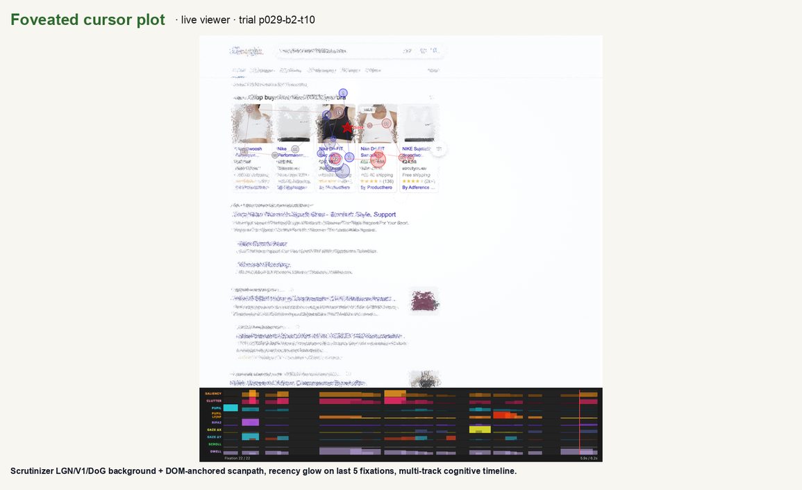
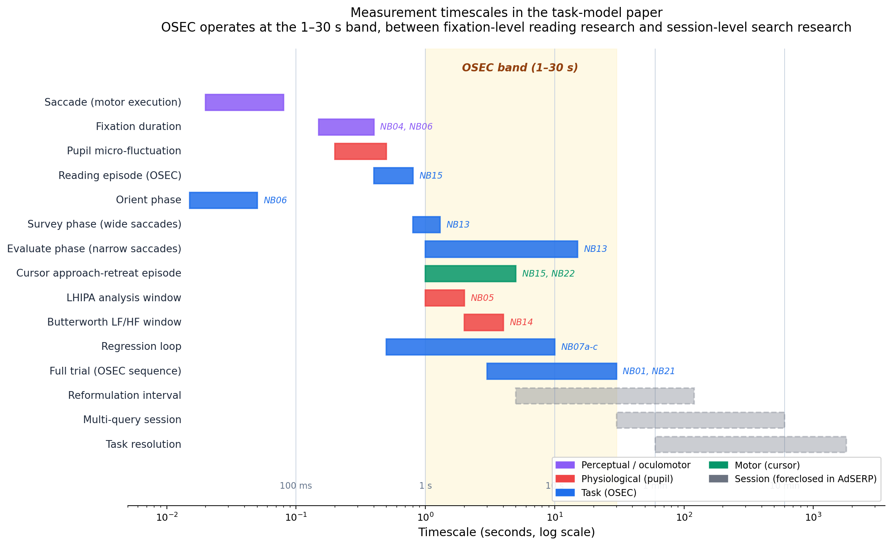

# Attentional Foraging on Search Results Pages

[Cursor Plots](https://andyed.github.io/attentional-foraging/) | [Why a task model](#why-a-task-model-not-another-classifier) | [Task Model](#the-task-model) | [Key Insights](#key-insights) | [Notebooks](#notebooks) | [Data](#data) | [Paper](#paper) | [What's Next](#whats-next)

---

> ## 📄 Enroute to arXiv: AllSERP
>
> **AllSERP: Exhaustive Per-Element Enrichment of the Versatile AdSERP Dataset** is under technical and moderation review at arXiv (submission `submit/7558357`, 2026-05-06). Announcement expected within a few business days; the public arXiv ID and DOI will be added here when it lands.
>
> The accepted-format PDF is committed to this repo for early sharing: [`allserp-paper.pdf`](./allserp-paper.pdf). The paper documents the typed AOI extraction pipeline, the per-element behavioral inventory, and the public release that the rest of this repository implements.

---

## The puzzle

People scan a page of search results in a recognizable shape — the **F-pattern** in heatmaps, with a steep click decay from top to bottom and odd boundary effects at the last visible result. Twenty years of web search literature has explained this as "position bias" — a *label* for the shape, not a *mechanism* for it. This project asks the mechanism question: what cognitive operations are actually running while a user evaluates a search results page, and which of the patterns we see are the operations vs. which are statistical artifacts of how the data was aggregated?

The answer turns out to be a four-phase task model — **Orient → Survey → Evaluate → Commit** — recoverable from eye tracking, pupil dilation, mouse trajectories, and scroll telemetry on 2,776 commercial search trials.

[Latifzadeh, Gwizdka & Leiva's AdSERP dataset](https://github.com/kayhan-latifzadeh/AdSERP) (SIGIR 2025) made it possible: one of the richest public datasets of search behavior, with simultaneous eye tracking, mouse tracking, scrolling, and pupil dilation from 47 participants across 2,776 trials. An AI-assisted [journey.md](./docs/journey.md) validated the dataset's utility; the [findings](./docs/findings.md) have been growing since.

The AdSERP signals span five orders of magnitude in time — from 7 ms pupil samples to 60-second trials. Our augmentations (organic-result bounding boxes, reading episodes, cursor approach episodes, Butterworth LF/HF windows, LHIPA) bridge the gap between raw sensor events and trial-level cognition, making per-result and per-phase analysis possible. ([Signal timescale breakdown](assets/temporal-spectrum.png))

> **On earlier framings.** This project began from two hypotheses that did not survive empirical test: the classic "ski-jump" terminal-click uptick at scale, and a lexical-priming explanation for the declining dwell curve. Both turned out to be either coordinate-bug artifacts or under-powered at the AdSERP grain, and the forward story (task model, cursor approach-retreat, graded-relevance reframe) overtook them. Audit back stories and what survived each one are documented in [`docs/null-findings/`](./docs/null-findings/) — the project documents null results in git even when they don't make it into papers, as a research-integrity commitment.

## Why a task model, not another classifier

Twenty years of web search modeling has been dominated by a single move: treat user behavior as a signal stream and learn a mapping from that stream to relevance. Click models (cascade, DBN, UBM) encode examination and stopping as statistical parameters. Cursor-feature classifiers extract 638-dimensional feature bags from mouse trajectories. Transformer-based sequence models now learn end-to-end maps from raw `(x, y, t)` to click. These approaches have produced real engineering gains and are the default framing in SIGIR, CIKM, and WSDM.

This project argues the framing misses a critical dimension. The user is running a *cognitive task*, and when that task is modeled explicitly — using the vocabulary of psychology and HCI task analysis the field already has — structure comes out of the data that pure signal-decoding leaves untouched. Phase boundaries become testable. Content-independent vs. content-modulated subprocesses separate. Forward evaluation and regressive re-evaluation stop being one blob. The four-class consideration-set taxonomy (clicked / deferred / evaluated-rejected / not-approached) recovers information that a 638-feature classifier leaves on the table, using 11 features, because the task model tells you which features matter.

The Survey phase operationalized in this paper was hypothesized by Zhang, Abualsaud & Smucker (CHIIR 2018) in the context of immediate requery behavior. We give it a saccade-level signature. The same move applies across the project: psychology and HCI already have the vocabulary; what this work adds is the measurement.

*Task models add a dimension, not just another feature.* That is the claim the whole repository is organized around.

## Cursor plots — two views, one dataset

We maintain **two** interactive cursor-plot viewers over the same AdSERP trials. They are complementary, not redundant — each makes a different trade:

### [Foveated cursor plots](https://andyed.github.io/attentional-foraging/) *(this repo)*

31 curated search sessions replayed on a **foveated-perception background** rendered by [Scrutinizer](https://github.com/andyed/scrutinizer2025) — sharp where the participant looked, blurred where they didn't, accumulated across the full scanpath. Adds an *LGN/V1/DoG-simulated visual-memory layer* that no other public SERP replay tool offers.

Innovations on top of a standard gazeplot:

1. **DOM-anchored fixations.** Fixations are pinned to the DOM element they landed on (via `elementFromPoint`), not to pixel coordinates — so the overlay survives layout reflow (Edmonds 2003 lineage).
2. **Foveated-perception background.** Shows what the participant could *resolve*, not just raw SERP pixels.
3. **Multi-track cognitive timeline.** Saliency, clutter, pupil, scroll, dwell as parallel ribbons; recency glow on the last 5 fixations.

**Known trade-off.** The SERP background is re-rendered from archived HTML at a different window width than the original capture (1422 → 1280 CSS px, 90% display scaling). DOM anchoring compensates for fixation placement, but the re-rendered page can still differ from what the participant actually saw — external resource loading (Maps tiles, product images) reflows element heights. See the *Positional accuracy* note on the site.

[](assets/gazeplot-hero.png)

### [Screenshot-accurate cursor plots](https://andyed.github.io/approach-retreat/replay/) *(sister repo: approach-retreat)*

86 curated trials replayed against the **original raw AdSERP screenshots** — pixel-for-pixel what the participant actually saw. No foveation, no HTML re-render. Overlays per-AOI **four-class taxonomy labels** (clicked / deferred / evaluated-rejected / not-approached) derived from cursor enter/dwell/exit episodes.

- 100% coordinate fidelity — screenshot is the ground truth the participant saw.
- Four-class taxonomy pills visualized inline on each result bbox.
- Same multi-track timeline (cursor + pupil + LF/HF + gaze + AOI labels).

**Known trade-off.** No foveated background — you see the SERP as a high-acuity reader would, not as peripheral vision delivers it mid-saccade.

**Which to use?** The foveated viewer for perception-resolution questions (what could they actually see at each fixation?). The screenshot-accurate viewer for label-geometry questions (which AOIs got approached, dwelled, rejected?). They share the same AdSERP source data and the same four-class taxonomy vocabulary.

---

## The Task Model

### How people evaluate search results (general model)

When you search for something, your eyes don't just read top to bottom. The process is a loop:

```
Orient → Survey → Evaluate ─┬─→ Click (commit to a result)
                  ↑          ├─→ Next page / Reformulate (the page wasn't good enough)
                  └──────────┘   └─→ Abandon (the task wasn't worth it)
                  (regression)
```

**Orient** — your eyes land on the page and find where the results start. **Survey** — a quick sweep of the result set, wide eye jumps, getting the gist. **Evaluate** — committed reading of individual results, narrow eye movements. Then you exit: click something, try a different query, or give up. *Regressions* — scrolling back up to re-examine earlier results — loop from evaluate back to survey.

The decision between those exits (stay, refine, or quit) is the core foraging decision, borrowed from behavioral ecology: just as an animal decides whether to keep foraging in a patch or move on, a searcher decides whether the current results page is worth continued investment.

### What we measured: the AdSERP forced-choice task

The AdSERP experiment eliminates two exit paths. Participants *must* click a result — no next page, no reformulation, no quitting. This isolates the orient–survey–evaluate–commit sequence.




The AdSERP pipeline measures signals across five orders of magnitude in time — from 20 ms saccades to 30-minute task resolutions. OSEC's contribution is the 1–30 s band (shaded) where fixation-level and session-level research previously left a gap. Orient (~0 ms, 58% of first fixations land directly on a result), Survey (~1.3 s with wide saccades at 107.8 px median, fixations 1–5), Evaluate (narrow saccades at 69.4 px median, fixations 6+, reading episodes ~500 ms), and Commit (click).

The transition from survey to evaluate is marked by a drop in saccade amplitude (the distance your eyes jump between fixations), detectable at p = 9.33 × 10⁻¹⁶⁸ within individual trials (mean per-trial Spearman ρ = −0.135, t = −29.63, N = 2,754). Survey ends around fixation 5; the first scroll happens around fixation 21 — these are decoupled events (94.6% of trials). Full evidence: [task-model-paper.pdf](./docs/arxiv/task-model-paper.pdf). Interactive explainer: [The Search Results F-Heatmap, Frame by Frame](https://andyed.github.io/attentional-foraging/explainer/).

**What this task can't tell us:** the stay/refine/abandon decision — the core foraging choice in real search. The forced-choice constraint means every trial ends with a click, which inflates regression rates (65% of trials) and eliminates the abandonment signal. Participants also completed ~60 trials each, so the crisp phase transitions likely reflect practiced behavior — the expert version of page scanning that power users exhibit in production. Validating the full model on first-time searchers requires production log data with natural stopping behavior.

---

## Key Insights

Detailed write-up with all statistical tests: [findings.md](./docs/findings.md).

### Position effect decomposition

[](https://github.com/andyed/attentional-foraging/blob/main/notebooks-v2/23_rank_effects.ipynb)

Both time and cognitive load decline with result position — but load drops *faster*. Cognitive effort (Butterworth LF/HF) peaks at position 0 where the user is building evaluation criteria from scratch, then drops steeply through positions 0–3 as criteria compile. By position 4, the framework is built and both curves plateau. This is **framework compilation**: the user becomes an expert evaluator within a single SERP scan.

- **Fixation count and dwell time decline directionally** (rho = -0.44 and -0.52, both ns at N = 10 positions) — less total investment at lower positions, though not significant at the position level. → [§3a](docs/findings.md#3a-evaluation-time-decomposes-into-four-independent-components)
- **Butterworth LF/HF declines significantly** (ρ = −0.655, *p* < 10⁻⁴ on N = 11 positions; bbox-organic attribution, NB14:K3 post-2026-05-01 cascade) — cognitive effort peaks during framework construction at position 0, then plateaus. → [§3b-iv](docs/findings.md#3b-iv-per-position-cognitive-load-decreases-not-increases--framework-compilation-not-working-memory-overload)
- **Survey duration is content-independent.** ~5 fixations, ~1.3 s median, no correlation with any difficulty measure. The survey's *output* (an impression of the result set) modulates strategy; its *duration* doesn't vary.

### Framework compilation

Cognitive load (Butterworth LF/HF) peaks at position 0 and drops steeply through positions 0–3 (steep-phase Spearman ρ = **−1.000** on *N* = 4, *p* = 3.2 × 10⁻²³ Mann–Whitney; full corpus ρ = **−0.655**, *p* < 10⁻⁴ on *N* = 11 position medians; bbox-organic attribution, NB14:K3/K10 post-2026-05-01 cascade), then plateaus through positions 4–10 (plateau-phase ρ = **+0.321**, *p* = 0.482 n.s.). Users are building evaluation criteria at the first result ("I want this price range, this brand tier, these features") and then applying those criteria with decreasing effort. Forward-only gaze dwell *ratio* increases with position (ρ = +0.82 on *N* = 9 position means) because the comparison set grows, while cost per comparison drops because criteria are already compiled. → [§3b-iv](docs/findings.md#3b-iv-per-position-cognitive-load-decreases-not-increases--framework-compilation-not-working-memory-overload).

### Difficulty

SERP difficulty isn't about how similar the results look to each other — it's about how clearly one stands out. *Relevance spread* (variance in how well each result matches the query, measured via embeddings) predicts page coverage (rho = 0.098), click position (rho = 0.046), and trial duration (rho = 0.043), all within-participant. Token overlap and embedding similarity between results don't predict behavior. When results are uniformly mediocre, you have to read more of the page.

### Behavioral signals (useful for search engineers)

- **Scroll context beats mouse-gaze distance** for click prediction. AUC 0.687 vs 0.531 (NB01, post coordinate-space audit). Where the user stopped scrolling is a stronger signal than where their cursor is. → [§6](docs/findings.md#6-viewport-state-predicts-clicks-better-than-distance)
- **Mouse proximity reveals the consideration set.** Cursor approach features raise click prediction AUC from **0.727** (position only) to **0.865** (LOSO M3, 47-fold; bbox-organic, NB21:K-bbox-3/6); approach alone matches the full model (M4 = **0.864** ≈ M3, NB21:K-bbox-4). Hybrid attribution (bbox organics + dd_top/native_ad rectangles) reaches M3 = M4 = **0.870** — the deployment-aware variant. The "consideration set" — results approached but not clicked — remains visible from mouse telemetry alone (specific share *[bbox re-derivation pending]*). → [§10](docs/findings.md#10-mouse-proximity-predicts-click--and-reveals-the-consideration-set), [NB21 Key Claims](docs/notebook-key-claims.md), [attribution-cascade-synthesis](docs/methodology/attribution-cascade-synthesis.md)
- **Backward scrolling is ballistic** (rho = 0.867). 87% of regression targets land at positions 0–4. When users scroll back up, they're going to a specific result, not re-scanning. → [§8](docs/findings.md#8-backward-scrolling-is-ballistic--the-viewport-mechanics-confound)
- **Pupillometric cognitive load is a boundary signal, not a gradient.** Trial-level LHIPA × click position is ρ = **−0.088**, *p* = 4.1 × 10⁻⁶ on *N* = 2,721 trials [NB05:K8] — statistically significant but small. The headline ρ = −0.903 is on *N* = 10 position means and is driven by a step-down at positions 9–10, not a gradual gradient (LHIPA is approximately flat across positions 0–8 then drops) [NB05:K9, ecological-fallacy warning]. Boundary clickers are working harder because the decision is hardest at the end of the page. → [§5](https://github.com/andyed/attentional-foraging/blob/main/notebooks-v2/05_lhipa.ipynb), [NB 23](https://github.com/andyed/attentional-foraging/blob/main/notebooks-v2/23_rank_effects.ipynb)

### Individual differences

Two independent trait dimensions emerged across participants: **deliberation style** (regression rate, time to first interaction, cognitive load) and **motor coupling** (how closely the cursor tracks gaze, split-half reliability r = 0.84 Spearman-Brown corrected). Neither predicts the other — how carefully you search and how you move your mouse are orthogonal traits. → [§11](docs/findings.md#11-two-orthogonal-individual-difference-dimensions)

---

## Dataset

[AdSERP](https://github.com/kayhan-latifzadeh/AdSERP) ([paper](https://doi.org/10.1145/3726302.3730325), [Zenodo](https://zenodo.org/records/15236546)) — Latifzadeh, Gwizdka & Leiva, SIGIR 2025. 2,776 transactional product queries, 47 participants, simultaneous eye tracking (Gazepoint GP3 HD, 150 Hz), mouse, scroll, pupil, SERP HTML snapshots, ad bounding boxes.

### Augmentations contributed by this project

AdSERP v1 ships ad bounding boxes but not organic-result bounding boxes, so per-rank analyses default to band estimation from h3 count and document height. This project contributes the missing AOIs:

- **Organic-result bounding boxes** in pixel-accurate screenshot coordinates, plus per-cell subdivisions of the dd_top carousel and dd_right product stack. Output JSON shape mirrors the v1 ad-boundary schema for drop-in compatibility. Pipeline: `scripts/extract_organic_bboxes.py` (CV row-projection + ad-rectangle subtraction). Methodology: [docs/methodology/organic-result-aoi-extraction.md](docs/methodology/organic-result-aoi-extraction.md). Status: pipeline applied to all 2,776 trials (2026-05-01); full cascade synthesis at [docs/methodology/attribution-cascade-synthesis.md](docs/methodology/attribution-cascade-synthesis.md).
- **Reading episodes**, **cursor approach/retreat episodes**, **Butterworth LF/HF cognitive-load windows**, and **LHIPA** are documented under [Reusable components](#reusable-components).

## Figure gallery

Canonical visualizations with source scripts, timestamps, and stats dumps live in [`scripts/output/figures/INDEX.md`](./scripts/output/figures/INDEX.md). Each canonical figure has a companion `*_summary.json` next to it for downstream citation.

## Notebooks

`notebooks-v2/` with shared [data_loader.py](./notebooks-v2/data_loader.py). Numbered to match paper sections.

| # | Notebook | Topic |
| --- | --- | --- |
| 00 | [skijump](https://github.com/andyed/attentional-foraging/blob/main/notebooks-v2/00_skijump.ipynb) | Click distribution by position, boundary uptick, cognitive load, satisficer/optimizer split |
| 01 | [convergence](https://github.com/andyed/attentional-foraging/blob/main/notebooks-v2/01_convergence.ipynb) | Mouse-gaze distance, scroll-enriched click prediction |
| 02 | [gaze_cursor_lag](https://github.com/andyed/attentional-foraging/blob/main/notebooks-v2/02_gaze_cursor_lag.ipynb) | Temporal lag between eyes and cursor, split-half reliability |
| 03 | [early_predictors](https://github.com/andyed/attentional-foraging/blob/main/notebooks-v2/03_early_predictors.ipynb) | Early-trial signals of which result gets clicked |
| 04 | [fixation_coverage](https://github.com/andyed/attentional-foraging/blob/main/notebooks-v2/04_fixation_coverage.ipynb) | How much of the page gets looked at, time to first interaction |
| 05 | [lhipa](https://github.com/andyed/attentional-foraging/blob/main/notebooks-v2/05_lhipa.ipynb) | Pupil-based cognitive load index, validated against behavioral measures |
| 06 | [orientation_evaluation](https://github.com/andyed/attentional-foraging/blob/main/notebooks-v2/06_orientation_evaluation.ipynb) | Cognitive phases, evaluation effort by position |
| 07a–c | [regressions](https://github.com/andyed/attentional-foraging/blob/main/notebooks-v2/07a_regressions_prevalence.ipynb) | How often, why, and how fast people scroll back up |
| 08 | [priming](https://github.com/andyed/attentional-foraging/blob/main/notebooks-v2/08_priming.ipynb) | Lexical priming — null at four granularities ([full writeup](./docs/null-findings/priming-null-result.md)) |
| 09 | [difficulty](https://github.com/andyed/attentional-foraging/blob/main/notebooks-v2/09_difficulty.ipynb) | What makes a search results page hard: relevance spread, reading episodes |
| 10 | [strategies](https://github.com/andyed/attentional-foraging/blob/main/notebooks-v2/10_strategies.ipynb) | Satisficer vs optimizer segmentation |
| 11 | [individual_differences](https://github.com/andyed/attentional-foraging/blob/main/notebooks-v2/11_individual_differences.ipynb) | Two independent trait dimensions across searchers |
| 12 | [regression_precision](https://github.com/andyed/attentional-foraging/blob/main/notebooks-v2/12_regression_precision_by_load.ipynb) | How precisely people target a result when scrolling back |
| 13 | [survey_phase](https://github.com/andyed/attentional-foraging/blob/main/notebooks-v2/13_survey_phase.ipynb) | Saccade amplitude evidence for the survey phase |
| 14 | [butterworth_cognitive_load](https://github.com/andyed/attentional-foraging/blob/main/notebooks-v2/14_butterworth_cognitive_load.ipynb) | Per-position cognitive load via Butterworth LF/HF filtering (Duchowski 2026) |
| 15 | [cursor_approach](https://github.com/andyed/attentional-foraging/blob/main/notebooks-v2/15_cursor_approach.ipynb) | Cursor approach-retreat as covert evaluation signal |
| 16 | [element_type](https://github.com/andyed/attentional-foraging/blob/main/notebooks-v2/16_element_type.ipynb) | Eye and pupil behavior on ads vs organic results |
| 17 | [scroll_retreat](https://github.com/andyed/attentional-foraging/blob/main/notebooks-v2/17_scroll_retreat.ipynb) | Scroll kinematics during regression — desktop null result |
| 18a | [ripa2_vs_lfhf](https://github.com/andyed/attentional-foraging/blob/main/notebooks-v2/18_ripa2_vs_lfhf.ipynb) | Three pupillometric methods compared (LHIPA, LF/HF, RIPA2) |
| 18b | [learning_curve](https://github.com/andyed/attentional-foraging/blob/main/notebooks-v2/18_learning_curve.ipynb) | Practice effects over 60 trials — power law, block-level, individual differences |
| 19 | [margin_fixations](https://github.com/andyed/attentional-foraging/blob/main/notebooks-v2/19_margin_fixations.ipynb) | Parafoveal preview between results — null (Rayner doesn't transfer to SERPs) |
| 20 | [approach_by_element](https://github.com/andyed/attentional-foraging/blob/main/notebooks-v2/20_approach_by_element.ipynb) | Cursor approach-retreat by element type — top ads impose discrimination cost |
| 21 | [click_prediction](https://github.com/andyed/attentional-foraging/blob/main/notebooks-v2/21_click_prediction.ipynb) | LOSO click prediction (AUC 0.859), 4-class taxonomy, threshold analysis |
| 22 | [four_class_taxonomy](https://github.com/andyed/attentional-foraging/blob/main/notebooks-v2/22_four_class_taxonomy.ipynb) | Deferred vs evaluated-rejected split using scroll regression (4-class F1 0.70/0.66) |

Legacy notebooks in `notebooks/`.

## Reusable components

Several pieces of this project are designed for reuse beyond AdSERP:

| Component | Location | What it does |
| --- | --- | --- |
| **Organic-result AOI extraction** | [extract_organic_bboxes.py](./scripts/extract_organic_bboxes.py) · [methodology](./docs/methodology/organic-result-aoi-extraction.md) | CV row-projection on AdSERP screenshots reconstructs organic-result bounding boxes (and dd_top / dd_right per-cell subdivisions) absent from the v1 release. Drop-in compatible with the shipped ad-boundary JSON schema. |
| **Shared data loader** | [data_loader.py](./notebooks-v2/data_loader.py) | Trial loading, scroll interpolation, result band estimation, SERP text extraction, fixation-to-position mapping. Eliminates per-notebook boilerplate. |
| **LHIPA computation** | [05_lhipa.ipynb](./notebooks-v2/05_lhipa.ipynb) | Cognitive load index from pupil dilation (Duchowski et al. 2020), validated against behavioral measures. Reusable on any Gazepoint GP3 pupil stream. |
| **Reading episode pooling** | [09_difficulty.ipynb](./notebooks-v2/09_difficulty.ipynb) | Merges consecutive fixations on the same result (connected by small eye jumps <100 px) into reading episodes. Recovers ~866 ms/trial of processing time invisible to raw fixation summation. |
| **Relevance spread** | [compute_difficulty_measures.py](./scripts/compute_difficulty_measures.py) | SERP difficulty via embedding-based query-result alignment variance. Requires local embedding server (mxbai-embed-large on port 8890). |
| **Saccade phase detection** | Survey-to-evaluate transition via sliding-window amplitude threshold. Currently inline in analysis code — not yet extracted into a standalone function. |
| **Foveated scanpath replay** | [`site/`](https://andyed.github.io/attentional-foraging/) + [build-gh-pages.js](./scripts/build-gh-pages.js) | SVG scanpath overlay on foveated renders. Playback, timeline scrubbing, gaze toggle. Self-contained HTML per trial. |

## Paper

[task-model-paper.pdf](./docs/arxiv/task-model-paper.pdf) — *Orient–Survey–Evaluate–Commit: A Cognitive Task Model for SERP Evaluation*. Pre-submission draft, target CHIIR 2027 or SIGIR resource track.

## Docs

- [findings.md](./docs/findings.md) — All findings with statistical tests (v8)
- [priming-null-result.md](./docs/null-findings/priming-null-result.md) — The hypothesis that drove the early work, why it was wrong, and what the investigation found instead
- [CHANGELOG.md](./CHANGELOG.md) — Version history and corrections
- [references.bib](./references.bib) — Verified BibTeX library
- [methodological-threats.md](./docs/methodological-threats.md) — Threats to validity and mitigations
- [journey.md](./docs/journey.md) — The first session, frozen at v0

<a id="whats-next"></a>
## What's Next

Highlights from the full [TODO.md](./TODO.md):

- **Saliency-guided survey** — do the initial wide eye sweeps target visually salient regions of the page? Requires saliency map export from [Scrutinizer](https://github.com/andyed/scrutinizer2025)
- **Product taxonomy partition** — commodity vs branded vs experiential queries ("buy AA batteries" vs "buy Nike Air Max" vs "buy winter jacket") may produce different foraging strategies
- **Full model validation** — the stay/refine/abandon decision needs production log data with natural stopping behavior
- **Windowed LHIPA by position** — pupil dilation trajectories during forward scanning as a cognitive load timeline (pending consultation on minimum analysis window size)
- **Forward-only vs regressive splits landed** in NB01/05/17/20/23/24 (April 2026). Cross-repo: `approach-retreat` Episode now carries direction natively. The remaining priming granularity — token-level fixation analysis mapping individual fixations to specific words — is tractable on AdSERP but not a priority now that framework compilation explains what the original conjecture was trying to explain. Context: [priming-null-result.md](./docs/null-findings/priming-null-result.md)
- **Mouse dwell vs time on screen** — normalize cursor dwell at each result by how long the result was actually in the viewport. Current dwell measures conflate "cursor lingered there" with "the result was visible for a long time"
- **Mouse resting position analyses** — characterize where cursors park between interactions (right margin? last clicked? centered?). Individual-differences candidate, connects to `mouse_independent` tag

## Sister project: approach-retreat

[**andyed/approach-retreat**](https://github.com/andyed/approach-retreat) — the deployable form of this research. Two focused goals:

1. **Practical harvesting of user decision-making signals.** A vendor-agnostic JavaScript library that captures the four-class taxonomy (clicked / deferred / evaluated-rejected / not-approached) from cursor telemetry alone — no eye tracker required. Drop it on a SERP, get the consideration set back as structured events.

2. **Deeper connection to prior work on cursor signals.** Reference docs trace the lineage through Huang/White/Buscher (gaze-cursor alignment, CHI '12), Guo & Agichtein (cursor for relevance, WWW '12 and earlier), Arapakis & Leiva (engagement from 638 cursor features, SIGIR '16), and the Attentive Cursor Dataset (2,737 users, Frontiers '20). The contribution of this project — the OSEC task model — is what that 15-year feature-engineering tradition was missing.

A CIKM 2026 paper draft is in progress; the library is the deployable form for production search UIs.

## Citation

```
Latifzadeh, K., Gwizdka, J., & Leiva, L. A. (2025).
A Versatile Dataset of Mouse and Eye Movements on Search Engine Results Pages.
Proc. 48th ACM SIGIR Conference, 3412-3421.
https://doi.org/10.1145/3726302.3730325
```

## License

Analysis code: MIT. The AdSERP dataset has its own [license](https://github.com/kayhan-latifzadeh/AdSERP/blob/main/LICENSE).
