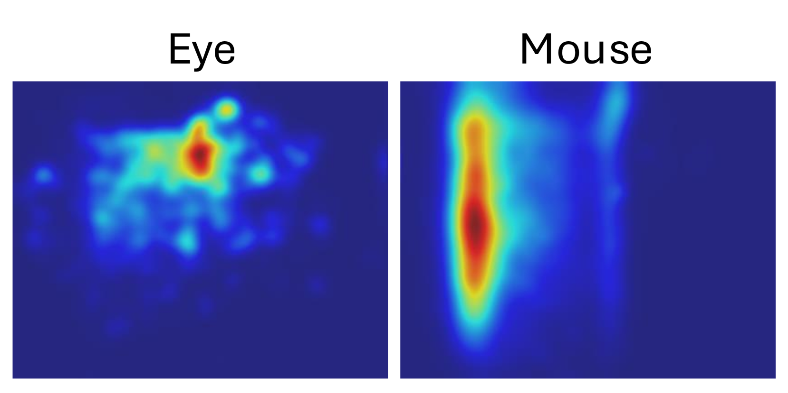
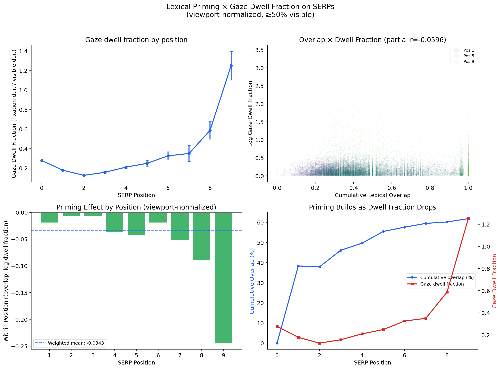
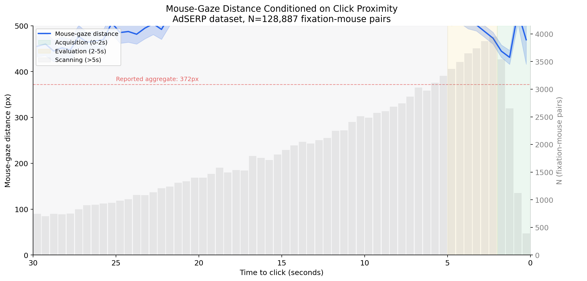
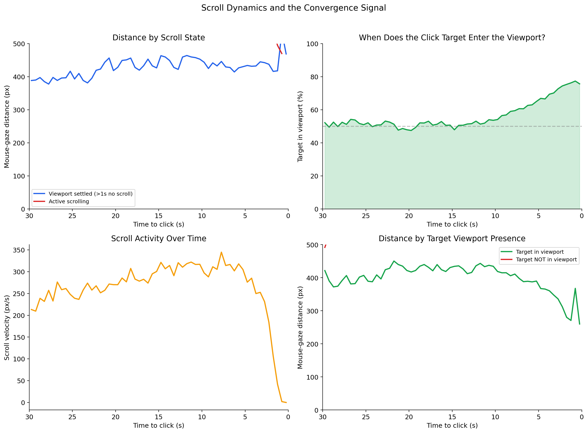

# Attentional Foraging on SERPs

**Dataset:** [AdSERP](https://github.com/kayhan-latifzadeh/AdSERP) ([paper](https://doi.org/10.1145/3726302.3730325), [data on Zenodo](https://zenodo.org/records/15236546)) — Latifzadeh, Gwizdka & Leiva, SIGIR 2025.

2,776 transactional search queries on Google, 47 participants, simultaneous eye tracking (Gazepoint GP3 HD, 150 Hz), mouse tracking, scroll events, pupil dilation, SERP HTML snapshots, and ad bounding boxes. One of the richest public datasets on how people actually look at and interact with search results.


*Eye vs. mouse heatmaps from the AdSERP paper (Figure 9). Eye fixations spread across results; mouse clusters in a single region. From [Latifzadeh et al. 2025](https://doi.org/10.1145/3726302.3730325).*

We found this dataset at 5am, got excited, and spent a morning exploring it. This repo is three notebooks of preliminary analysis — questions we wanted to ask, first-pass answers, and a transparent record of how we got there.

> **v4 — 2026-04-01. Ongoing revisions from initial <4 hour first pass.**
>
> **Revision strategy:** The [journey doc](docs/journey.md) is frozen at v0 — the first session as it happened, including wrong turns. Future updates add a "What we got wrong" section and revise the [findings](docs/findings.md). The point is to show the full arc.
>
> Built collaboratively by a human researcher and [Claude Code](https://claude.ai/claude-code). See [docs/journey.md](docs/journey.md).

---

## How we measure evaluation time

The eye tracker (Gazepoint GP3 HD, 150 Hz) records **fixation duration** — how long the eye holds still on a location. This is the direct measure of how long someone looked at something. We sum all fixation durations that fall within each result's page-space Y band to get **total fixation time per result** — our primary measure of evaluation time.

To assign fixations to results, we estimate each result's vertical boundaries from the SERP document height and number of results extracted. This is approximate. The AdSERP dataset includes **ad boundary data** (`ad-boundary-data.zip` on [Zenodo](https://zenodo.org/records/15236546)) with exact pixel bounding boxes for native ads, top display ads, and right-rail display ads. These give us precise Y positions for ad elements — the organic results fill the space around them. Combining ad boundaries with our h3-based result extraction would sharpen the fixation-to-result mapping. Pending.

We also compute **viewport time** — how long each result was ≥50% visible on screen (IAB viewability threshold), derived from the scroll event timeline. This lets us distinguish "evaluated briefly because it wasn't visible long" from "evaluated briefly because it was easy to process."

Full writeup with caveats: **[docs/findings.md](docs/findings.md)**

---

## Findings

### Results get less evaluation time as you scroll down

Total fixation time per result (eye-tracker, scroll-corrected page-space coordinates):

| Position | Fixation (ms) | Viewport (ms) | Dwell Ratio | Overlap |
|----------|--------------|---------------|-------------|---------|
| 0 | 4,085 | 14,584 | 0.28 | 0% |
| 1 | 3,071 | 17,990 | 0.18 | 38% |
| 3 | 2,103 | 16,526 | 0.16 | 46% |
| 5 | 1,589 | 9,577 | 0.25 | 55% |
| 7 | 1,325 | 6,529 | 0.35 | 58% |
| 9 | 2,497 | 3,378 | 1.25 | 59% |

Fixation time drops 65% from position 0 to position 7. Gaze dwell ratio — fixation duration / visible duration — drops from 0.28 to 0.16 by position 3, then *rises* back through positions 4-9. The U-shape means later results get more intense evaluation per unit of visible time, not less. The uptick at position 9 is the **"ski jump"** — users click disproportionately on the last visible position before a pagination boundary. This pattern has been observed in click share data at eBay, Redbubble, MSN Search, and others (also reported by SLI Systems, Jakob Nielsen, Lou Rosenfeld). The explanation: people make a locally rational decision between the last set of results and the temporal/attentional cost of Next (Edmonds, ["Search as Augmented Cognition,"](https://www.linkedin.com/in/andyed/) CHIIR Made to Measure Workshop, 2021). The same talk proposed the priming hypothesis tested here: *"Why does result evaluation speed up? Hypothesis: Semantic priming and reduced cost of lexical processing, verifiable by manipulating heterogeneity of search results."* In this lab study, the forced-click task likely amplifies the ski jump — there is no Next button, so position 9 *is* the boundary.

### Lexical overlap builds rapidly — and that should matter

By position 9, 62% of a result's vocabulary has already appeared in prior results. Novel tokens per result drop from 28 to 10.

Why this matters: **lexical priming**. In reading research, previously encountered words are processed faster on re-encounter — less cognitive effort to recognize, categorize, and integrate. If a SERP user has already read "electro-harmonix tone tattoo analog delay" in results 1-3, encountering those same terms in result 7 should be cheaper to evaluate. The standard explanation for faster evaluation at lower positions is declining effort or attention fatigue. The alternative: it's cumulative priming from vocabulary redundancy. **However:** our analysis shows this effect operates in re-evaluation (scroll regressions), not in first-pass forward scanning — and when we test the forward-only curve shape, the relationship reverses (dwell *increases* with overlap, Spearman ρ = +0.73). See below.




### Priming: aggregate correlation does not survive within-position controls

We hypothesized cumulative lexical overlap would predict shorter evaluation time — the alternative to "declining effort" as an explanation for faster evaluation at lower positions. The aggregate correlation exists (partial r = -0.054, p = 2.4×10⁻⁹) and is concentrated in regression trials (r = -0.033, p = 0.003), absent in first-pass trials (r = -0.002, p = 0.92).

**v3 correction:** When we test within each position — comparing high-overlap vs low-overlap trials at the same rank — the effect is null across all metrics (TFT, TFC, mean fixation duration, viewport time). The aggregate correlation was driven by the position-overlap confound: both decline together because they're both functions of rank.

**The priming hypothesis is not rejected — it's untested at the right granularity.** Bag-of-words overlap at the result level is too coarse. Paths forward: semantic embeddings, token-level fixation mapping, and at-scale production logs with larger N. See [findings.md](docs/findings.md) for the full decomposition.

### p(fixate | visible) is also null — and structurally uninformative

We tested whether overlap predicts *skipping* results entirely (binary: fixated or not). The aggregate signal looks real (r_pb = -0.059, 8/9 positions in skip direction) but forward-only p(fixate) is ~99.8% at every position. During first-pass scanning, users fixate virtually everything visible — there is no skip decision for overlap to predict. The 12.5% skip rate is concentrated in regressions.

### Evaluation time decomposes into four components

Per-fixation duration is **flat at ~220ms** regardless of position. The position-dependent decline in total fixation time comes from investing fewer fixations at lower positions — an attention allocation decision. Page orientation time (~1-3s) and linear scanning rate (~1.7-2.6s/position) are the other components. This reframes the priming question: if content effects exist, they should appear in fixation *count*, not fixation *duration*.

### Scroll regressions are the dominant pattern

69% of trials involve scrolling back up. Mean 2.8 regressions/trial, ~7 result slots of travel. Regression count correlates with decision time (r=0.660). The high rate is likely inflated by the forced-choice task — participants must click, so they re-evaluate rather than abandon.


### Mouse-gaze convergence depends on click intent

With scroll-corrected page-space coordinates, mouse-gaze distance starts low (~90px, both near page top), then rises monotonically as the user scrolls (gaze follows content down the page, mouse stays in screen space — the offset accumulates). Distance peaks near ~500px. A modest downturn appears in the final 1-2 seconds before click, but the "sharp convergence" we reported in v0 was largely an artifact of uncorrected coordinates. The corrected picture is dominated by scroll accumulation, not by motor convergence.



### Viewport state predicts clicks better than distance

At a 5s horizon, viewport features (target visible, time since scroll) outperform mouse-gaze distance alone (AUC 0.704 vs 0.548). The scroll-stop event is the stronger click signal.



---

## Theoretical framework

These findings are interpreted through the **Attentional-Foraging Equilibrium (AFE)**, which synthesizes Rational Inattention (Sims 2003) with Information Foraging Theory (Pirolli & Card 1999). AFE models SERP browsing as patch foraging: lexical priming reduces within-patch handling time during re-evaluation (not first-pass scanning), scroll regressions are travel costs paid for re-evaluation, and the convergence curve traces the transition from foraging to exploitation. The forced-choice purchase task in AdSERP is useful here because it creates a defined stopping criterion — making the patch-leaving decision observable where most SERP studies cannot (cf. [Diriye et al. 2012](https://doi.org/10.1145/2396761.2398399) on search abandonment as the alternative outcome). Full framework: [AFE presentation](https://gamma.app/docs/The-Attentional-Foraging-Equilibrium-A-Synthesis-of-Digital-Behav-aq0bw2ujjxwypbt). Detailed mapping in [findings.md](docs/findings.md).

---

## Notebooks

| Notebook | nbviewer | Topic |
|----------|----------|-------|
| **Convergence** | [View](https://nbviewer.org/github/andyed/attentional-foraging/blob/main/notebooks/convergence_analysis.ipynb) | Mouse-gaze distance conditioned on click intent, scroll-enriched prediction |
| **Regressions** | [View](https://nbviewer.org/github/andyed/attentional-foraging/blob/main/notebooks/scroll_regressions.ipynb) | Scroll regression prevalence, magnitude, timing, sparklines |
| **Priming** | [View](https://nbviewer.org/github/andyed/attentional-foraging/blob/main/notebooks/serp_priming.ipynb) | Cumulative lexical overlap × evaluation time; within-position controls null, forward-only dwell reverses |
| **Coverage & TTI** | [View](https://nbviewer.org/github/andyed/attentional-foraging/blob/main/notebooks/fixation_coverage.ipynb) | Fixation coverage above click, TTI, processing speed calibration |
| **User Strategies** | [View](https://nbviewer.org/github/andyed/attentional-foraging/blob/main/notebooks/user_strategies.ipynb) | Satisfice vs optimize segmentation by regression rate |

## Data

Behavioral data (~15MB) from [Zenodo](https://zenodo.org/records/15236546). SERP HTML (~535MB) for notebook 3 only.

```bash
cd AdSERP/data
curl -L -o fixation-data.zip "https://zenodo.org/records/15236546/files/fixation-data.zip?download=1"
curl -L -o mouse-movement-data.zip "https://zenodo.org/records/15236546/files/mouse-movement-data.zip?download=1"
curl -L -o trial-metadata.zip "https://zenodo.org/records/15236546/files/trial-metadata.zip?download=1"
unzip -q fixation-data.zip && unzip -q mouse-movement-data.zip && unzip -q trial-metadata.zip
```

```bash
uv sync && uv run jupyter execute convergence_analysis.ipynb --inplace
```

## Docs

- **[findings.md](docs/findings.md)** — What we think we found, with caveats
- **[journey.md](docs/journey.md)** — The first session, frozen at v0
- **[adserp-key-claims.md](docs/adserp-key-claims.md)** — The AdSERP paper's claims and what the dataset enables
- **[adsight-key-claims.md](docs/adsight-key-claims.md)** — AdSight companion paper analysis (Transformer mouse→fixation prediction)
- **[references.bib](references.bib)** — Verified BibTeX library (20 entries, all with DOIs or arXiv IDs)

<a id="whats-next"></a>
## What's Next

- ~~**Per-result priming → evaluation speed**~~ Tested. **Prior hypothesis: lexical priming would predict faster evaluation generally.** Disconfirmed for first-pass scanning: forward-only dwell curve shows *increasing* dwell with position (Spearman ρ = +0.73, permutation p = 0.98 against priming). The aggregate partial r = -0.060 is entirely driven by regressions (9/9 positions in priming direction during re-evaluation). Within-position controls show the aggregate was confounded by position-overlap covariation.
- **Sharpen the overlap metric** (may reveal first-pass effect the crude measure missed):
  - Stemmed tokens (running/runs/runner → run)
  - Sentence embeddings (mxbai-embed-large) for paraphrase/synonym priming
  - TF-IDF weighted overlap — distinguish high-information from noise
  - Bigram/trigram overlap — phrase-level priming
- **Per-fixation analysis:** First-fixation duration (initial orientation) vs total fixation. Classic reading measure, more sensitive to priming.
- **First-click-only at scale:** Production logs, no forced choice, natural satisficing — the clean first-pass test this dataset can't provide.
- **Earliest click predictors:** First fixation revisit, mouse drift onset, scroll deceleration
- **Local novelty → regression triggers:** Per-result novelty predicting next scroll-back (time-series)
- **Pupil dilation × regressions**
- **AOI-filtered analysis:** Separate navigational from result-evaluation fixations

## Citation

```
Latifzadeh, K., Gwizdka, J., & Leiva, L. A. (2025).
A Versatile Dataset of Mouse and Eye Movements on Search Engine Results Pages.
Proc. 48th ACM SIGIR Conference, 3412-3421.
https://doi.org/10.1145/3726302.3730325
```

## License

Analysis code: MIT. The AdSERP dataset has its own [license](https://github.com/kayhan-latifzadeh/AdSERP/blob/main/LICENSE).
