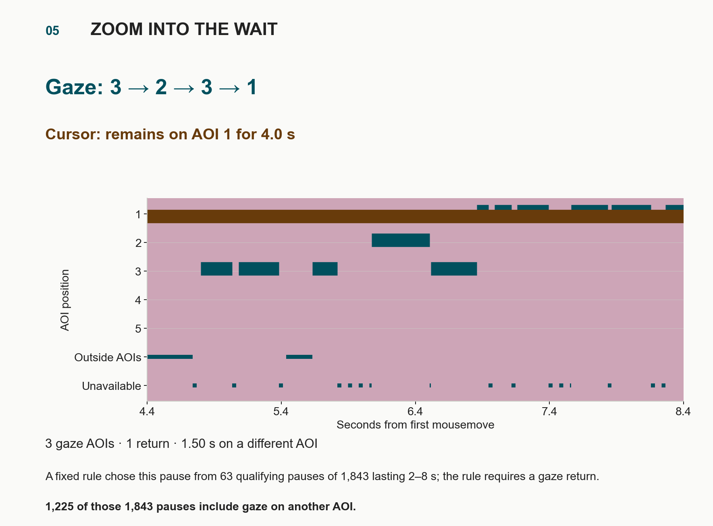

# Not a cascade: examination includes returns

**Scope:** descriptive search-process evidence, current integration 29 September 2026.
**Regime:** LAB, AdSERP, typed main-column AOIs, including ads and widgets.

A searcher can examine a result, inspect something else, and come back before
acting. The object of study here is that sequence: what changes when attention
moves away, what is revisited, and how examination becomes action.

## What “cascade” means here

The original cascade account describes sequential examination from the top
of the ranking, ending when a worthwhile result is encountered. That specific
one-way examination assumption is the contrast here. The original paper
presents it as an explanation of position effects in early ranks, which is a
narrower claim than a complete account of cognition.
[Craswell et al., *An Experimental Comparison of Click Position-Bias Models*](https://www.microsoft.com/en-us/research/publication/an-experimental-comparison-of-click-position-bias-models/)
([DOI](https://doi.org/10.1145/1341531.1341545); existing BibTeX key `craswell2008positionbias`).

Click modeling has already moved past the single pass. Xu et al. add
revisiting to click models
([WSDM 2012](https://doi.org/10.1145/2124295.2124334); BibTeX `xu2012revisit`).
Wang et al. start from the observation that much examination and clicking is
non-sequential and build that into the Partially Sequential Click Model
([SIGIR 2015](https://doi.org/10.1145/2766462.2767712); `wang2015pscm`).
Zhang et al. report from an eye-tracking study that click decisions depend on
adjacent results, and model them as comparisons
([WWW 2021](https://doi.org/10.1145/3442381.3449918); `zhang2021cbcm`).
The contribution here is measurement rather than the observation that returns
occur: per-position rates on typed AOIs, and gaze and cursor recorded together
so their sequences can be compared under one visit definition.

The single-pass assumption has two parts, and they fare differently. Coverage
largely holds: 94.0% (95% CI 92.0–95.7, participant-cluster bootstrap) of
AdSERP paths that end on an organic click have entered every organic result
above it; Lorigo et al. report the same full coverage for 67% of their paths
that end in a selection (external figure). **[LAB, AdSERP, typed]** Order does
not: applying Lorigo et al.'s own definitions, 16.6% of scanpaths are strictly
linear, 36.1% linear with regressions, and 47.3% nonlinear
([scanpath linearity](ablations/scanpath_linearity.md);
[Lorigo et al., IP&M 2006](https://doi.org/10.1016/j.ipm.2005.10.001)). So the
results above the click are usually examined; what fails is examining them
once, in order.

The attentional-foraging observations require an account that permits backward moves and
reinspection. They do not imply that every trial is nonlinear, that page
position is irrelevant, or that every sequential account excludes returns.
The word “cascade” elsewhere in this repository can also mean a pipeline of
AOI-attribution corrections; that is unrelated to this behavioral claim.

## A first visit often opens a loop

The [first-visit analysis](ablations/next_action_by_position.md) starts at the
first fixation assigned to a result. A visit is the consecutive run of
fixations on that result. Its endpoint is the next fixation elsewhere or the
end of the trial. Fixations are assigned to positions by vertical band (page y
only), and positions include ads and widgets; the posters below use strict
x/y rectangles instead. In that 2,606-trial analysis:

- At each typed position from 2 through 10, a backward move ends approximately
  50–57% of first visits; moving forward one position accounts for 32–38%.
  **[LAB, AdSERP, typed, NB38:K8]**
- Among backward departures, the destination has already been visited in
  approximately 75–92% of cases, depending on position. **[LAB, AdSERP, typed, NB38:K8]**
- Of the 1,377 backward excursions from position 2, about 75% return to
  position 2 before any previously unvisited result is entered. **[LAB, AdSERP, typed, NB38:K9]**

These are different conditional proportions. None means “75% of search time”
or “75% of all trials.” The imported
[aggregate snapshot](visualizations/evidence/next-action-by-position.json)
backs these values; the existing producer is
[`next_action_by_position.py`](../scripts/next_action_by_position.py).

A schematic such as `2 → 1 → 2 → 3` shows the extra event a downward-only
summary erases: the searcher revisits an earlier result before continuing.
The schematic is not a sampled trial. It motivates questions about comparison
and checking, rather than assigning those purposes to every return.

## The eyes and cursor participate differently

The [sequence poster](visualizations/gaze-cursor-echo/index.html) uses a different
cohort and visit rule: 2,650 trials, a clock from first mousemove to final press,
and visits containing at least 100 ms of observed AOI occupancy. Do not combine
its rates with the first-visit table as if they had a shared denominator.

| Observation | Dependent measure and denominator | Process implication |
| --- | --- | --- |
| Gaze: 40.4 AOI changes/min; cursor: 14.2/min | Qualifying changes per minute of 6.068 hours covered by both channels | The recorded eye path samples between results more often |
| Gaze: 16.0 backward steps/min; cursor: 4.7/min | Moves to a smaller AOI position during the same common coverage | Backtracking remains visible when coverage is held common |
| 23.8% different-AOI gaze during cursor rest | Exact overlap duration divided by cursor-resting-inside-AOI duration; cursor held at most 2 s (27.6% when held until its next move) | A cursor pause can accompany continued visual examination |
| 66.5% gaze-first; median first-entry difference +939 ms | First qualifying entries into 8,175 trial–AOIs visited by both signals; positive means cursor later | Gaze more often reaches a jointly visited result earlier |
| Median +2 ms in nearby pairs; gaze first 55.3% without clock-origin pairs | 10,321 one-to-one same-AOI visit pairs within ±2 s; 9,128 after removing pairs that start at the first mousemove, where the cursor's first visit starts in 1,552 of 2,650 trials (median +49 ms) | A small gaze lead among nearby visits; this selected subset cannot establish a general follower lag |

**[LAB, AdSERP, typed]** Sources: [sequence aggregates](visualizations/gaze-cursor-echo/summary.json),
[common-coverage checks](visualizations/gaze-cursor-echo/checks.json),
[rest-duration aggregates](visualizations/evidence/resting-cursor/summary.json).
The sequence poster shows participant-cluster confidence intervals. Comparing
native fixation segmentation with cursor samples still limits physiological
interpretation, even after matching coverage.

### A pause contains an excursion

In trial `p021-b1-t6`, the cursor remains within AOI 1 during the four-second
interval shown. Gaze visits `3 → 2 → 3 → 1`, spending 1.50 seconds on a different
AOI from the cursor. A fixed rule chose the example from 63 pauses of 2–8 s
with at least three gaze AOIs, a gaze return and at least 60% gaze-in-AOI
coverage, so it shows the pattern rather than a typical pause. Of 1,843 cursor pauses lasting 2–8 s, 10.7% contain three or
more gaze AOIs and a return, and 66.5% contain any gaze on another AOI
([example-rule counts](visualizations/gaze-cursor-echo/checks.json)). **[LAB, AdSERP, typed]**

Rodden et al. named this pattern *marking*: the pointer stays on the most
promising result read so far while the eyes check others
([CHI '08 Extended Abstracts](https://doi.org/10.1145/1358628.1358797)). They
described it from inspection and reported no rate. Measured here on a
different set and threshold from the counts above (the 3,500 cursor pauses
that end before the final approach, and at least 100 ms of gaze), 65.1%
(95% CI 62.0–68.4) contain gaze on another result under the poster's 2 s cursor
hold. Holding a still pointer until it next moves gives 74.5% of 4,221 such
pauses, and also moving the held position with page scroll gives 71.1% of 4,174. The pattern appears in 42.5% of
trials under the 2 s hold (45.8% and 46.2% under the two uncapped rules) and in
all 47 participants. The parked result is the eventual click 1.53, 1.46 and
1.40 times as often as its position predicts under the three rules
([cursor marking](ablations/cursor_marking.md)). Its edge over the result the
eyes examine most during the same pause is small and not robust to the hold
rule: +4.8, +3.9 and +0.9 percentage points of click share, with intervals
that reach zero. **[LAB, AdSERP, typed]** The pause marks a candidate; it does not show that the hand holds
information the eyes lack. Whether the searcher intends the pointer as a
bookmark, or the hand simply stays where it last stopped, is not tested.

## From observable movement to cognitive explanation

**Reinspection is observed. Comparison is inferred.** A return establishes
that attention revisited an AOI. It does not establish whether the searcher
compared prices, checked a remembered detail, corrected a reading error, or
prepared a selection. The [return-geometry analysis](ablations/return_is_memory.md)
adds evidence relevant to memory guidance; it should carry that argument.

**Dwelling is a duration, not an evaluation verdict.** Time inside an AOI may
include reading, waiting or cursor parking. A single visit cannot establish
rejection; a return cannot establish preference. Gaze and cursor visits are
separate observations even when they occur in the same rectangle.

**Forward progress and loops coexist.** Reading order can structure movement
without requiring each result to be visited exactly once. The recurrent-evaluation account
keeps these loops visible. An excursion does not establish a new survey
phase, and forward movement alone does not establish commitment.

**Commitment is the endpoint observed in this task.** The information-space
poster aligns the final approach with gaze and the physical press. It cannot
supply the missing decisions to abandon, reformulate or continue on another
page, because the task required a selection.

## Read the two posters together

[One clock, many views](visualizations/information-space-poster/index.html)
answers where recorded time is spent: inside and outside results, above and
below the initial fold, in motion or below displacement thresholds. It retains
off-AOI and unavailable intervals as separate states.

[While the mouse waits, the eyes travel](visualizations/gaze-cursor-echo/index.html)
asks how visits are ordered within that time. The same result can be revisited;
the same cursor pause can contain several gaze visits. The close-up gives the
aggregate a concrete example without turning that example into a population
estimate.

Together they characterize an iterative examination process. Establishing
why a particular loop occurs requires additional evidence, such as task or
content contrasts and independent reports of the searcher's purpose.
