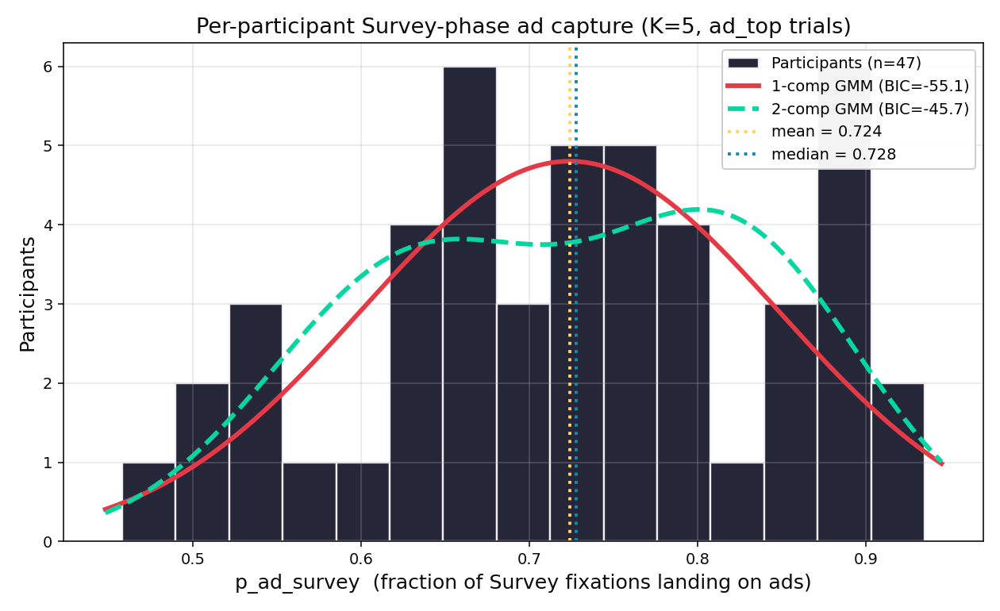

# Survey-phase ad capture: per-participant bimodality check

**Date:** 2026-04-12
**Parent:** `docs/survey-phase-vs-ads.md`
**Script:** `scripts/analyze_survey_bimodality.py`
**Outputs:** `scripts/output/survey_bimodality/`

## Question

The parent analysis reported that on `ad_top` trials (DoubleDeck shopping ads at the top of the SERP), Survey-phase fixations (first K=5) over-index on ads at **2.45x the base rate defined by ad area**. That number is a cohort mean. It could hide participant heterogeneity: a bimodal split between ad-magnet and ad-avoidant participants would mean the headline describes an average of two populations, not a typical person. A right-skewed distribution would mean the effect is carried by a susceptible tail.

This follow-up asks whether the per-participant distribution of `p_ad_survey` (the fraction of each participant's Survey-phase fixations that land inside an ad region, on `ad_top` trials, at K=5) is unimodal, bimodal, or right-skewed, and whether the over-indexing is uniform across participants or concentrated.

## Data

- 47 participants, each contributing between 18 and 40 `ad_top` trials (mean ≈ 34).
- `p_ad_survey` computed as `sum(n_survey_on_ad_K5) / sum(n_survey_fix_K5)` across each participant's `ad_top` trials. This is a pooled per-participant rate rather than a mean-of-trial-means, which is stable for participants with sparse Survey fixations on individual trials.
- Source: `scripts/output/survey_vs_ads/per_trial.csv` (no re-run of the upstream extractor required).

## Distribution shape

| statistic | value |
|---|---|
| n participants | 47 |
| mean | 0.724 |
| median | 0.728 |
| SD | 0.125 |
| IQR | 0.640 - 0.819 |
| range | 0.458 - 0.935 |
| skewness | -0.15 |
| excess kurtosis | -0.84 |
| Shapiro-Wilk | W = 0.969, p = 0.23 |

The cohort mean of 0.724 (divided by the mean `ad_area_frac` of 0.298 on this slice) reproduces the parent analysis's ~2.45x headline. Skewness is near zero and slightly *negative* (if anything, a left tail), not right-skewed. Excess kurtosis is -0.84, meaning the distribution is a touch flatter than Gaussian — consistent with a broad unimodal mass, not two peaks. Shapiro-Wilk fails to reject normality (p = 0.23). A simple uniform-reference dip statistic (fallback shape test, since `diptest`/`scipy.stats.diptest` are unavailable in this environment) lands at 0.15, well within the range a single smooth mode can produce at n = 47.

## Gaussian Mixture Model fit

| model | BIC | AIC | components (mean ± SD, weight) |
|---|---|---|---|
| 1-component | **-55.07** | -58.77 | 0.724 ± 0.124, w = 1.00 |
| 2-component | -45.72 | -54.97 | 0.635 ± 0.087, w = 0.52 • 0.821 ± 0.076, w = 0.48 |

Delta BIC (k1 minus k2) = **-9.34**. Negative delta BIC means the 1-component model wins, and by a wide margin: a BIC difference of 9.3 is conventionally described as "strong" evidence against the more complex model. The 2-component fit does find two centers (0.635, 0.821) with near-equal weights, but these are slices of a single smooth distribution, not two genuine subpopulations separated by a gap — the penalty for two extra parameters outweighs the modest likelihood improvement.

## Tercile comparison

Sorting the 47 participants by `p_ad_survey` and splitting into low/mid/high terciles:

| tercile | n | mean p_ad_survey | mean ad_area_frac | **over-index ratio** |
|---|---|---|---|---|
| low  | 16 | 0.586 | 0.293 | **2.00x** |
| mid  | 16 | 0.727 | 0.298 | **2.44x** |
| high | 15 | 0.867 | 0.299 | **2.90x** |

The central result: **every tercile over-indexes on ads**. The lowest third of participants — the "most ad-avoidant" subgroup we have — still captures at twice the base rate during the Survey phase. The highest third sits at 2.90x. The range 2.00x–2.90x is not a split between avoidance and capture; it is a spread of magnitudes above a shared floor that itself is meaningfully above chance. The cohort 2.45x is not an average of capturers and non-capturers; it is a representative value that holds, with compression, across the entire sample.

## Do other traits track the gradient?

Comparing low vs high tercile on candidate moderators from `nb11_participant_panel.json` and `chattiness_per_participant.json` (Mann-Whitney U, two-sided):

| trait | low median | high median | p |
|---|---|---|---|
| mean LHIPA | 0.041 | 0.044 | 0.49 |
| regression rate | 0.575 | 0.567 | 0.87 |
| mean click position | 5.59 | 5.71 | 0.54 |
| median TTI (s) | 5.80 | 5.30 | 0.55 |
| mean fixations / trial | 85.0 | 90.5 | 0.74 |
| events/sec (cursor chatter) | 16.6 | 13.5 | 0.20 |
| dir changes/sec | 0.81 | 0.54 | 0.11 |

Nothing reaches p < .05. The closest signal — cursor direction-change rate, where the low tercile is *more* chatty — is n.s. at p = 0.11 and points the opposite direction from an obvious "high-capture = sloppier attention" story. Cognitive load (LHIPA), regression behavior, click outcomes, and time-to-interaction all fail to discriminate high vs low survey-ad capture. Individual variation in Survey ad capture, within this sample, is not tracking any of the standard load or outcome metrics the notebooks already compute.

## Verdict

**Unimodal.** Per-participant `p_ad_survey` on `ad_top` trials is a single smooth mode, symmetric (mild left skew, not right), slightly flatter than Gaussian, with no gap and no outlier tail. GMM BIC strongly prefers 1 component over 2 (delta = -9.3). Shapiro-Wilk cannot reject normality.

**Uniform effect, not a subgroup.** The 2.45x headline is not driven by a high-capture subpopulation hiding behind a low-capture one. Every tercile over-indexes: 2.00x / 2.44x / 2.90x. The worst-capturing third of participants still show 2x ad over-indexing during the Survey phase — the floor is high, and the spread across participants is compression around that floor, not a bifurcation.

**Interpretation for the paper.** The single-population "gist + capture" reading of the Survey phase stands. The Survey phase looks like an early involuntary layout response to salient elements that applies across participants, not a strategy difference between ad-magnet and ad-avoidant groups. "Average user captures on ads during the Survey phase" is a safe characterization — it generalizes across the full participant range, and no candidate moderator (LHIPA, regression rate, click position, TTI, fixation count, cursor chatter) discriminates the high tail from the low tail. Whatever drives participant-level variation in Survey ad capture is not in the usual trait basket, and is a small perturbation on a large shared effect.
