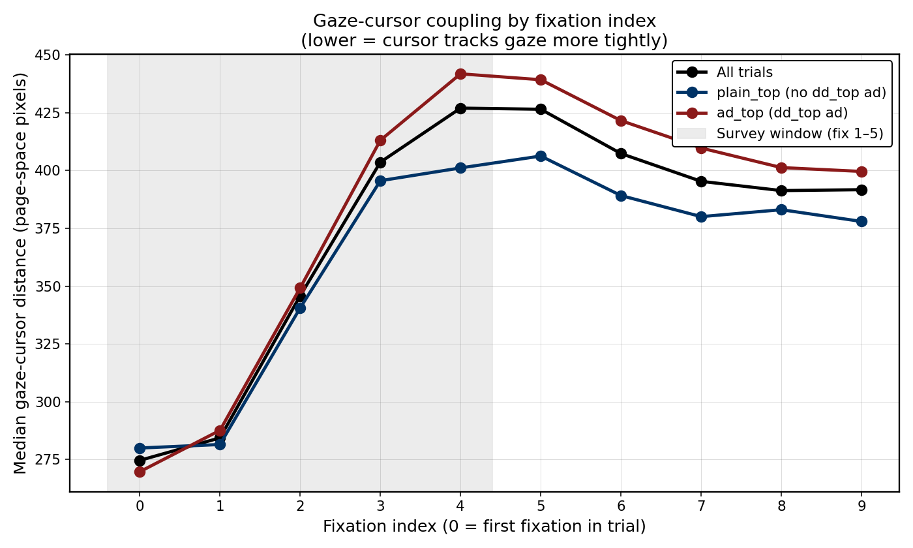

# Survey phase vs ads, follow-up 4: gaze-cursor coupling

*2026-04-12. N=2767 trials (1580 ad_top, 1187 plain_top). Self-contained
reproducer: `scripts/analyze_survey_gaze_cursor_lag.py`. Outputs in
`scripts/output/survey_gaze_cursor_lag/`.*

## Motivation

Follow-up 1 (`docs/survey-phase-vs-ads.md`) showed that Survey-phase
fixations over-index on ad rectangles by 2.45× corpus-wide. That
tells us **where** the Survey fixations land but not **whether the
user is already committing motorically**. Cursor motion is an
orthogonal signal: if Survey is passive gist formation, the cursor
should lag gaze loosely; if Survey is active scanning with proto-
commitment, cursor should track gaze tightly — especially on the
very first fixation.

The test: per-trial median gaze-cursor Euclidean distance (page-space)
during Survey (fixations 1–5) vs Evaluate (fix 6 through last
pre-click), both cohorts plus conditioned on whether the first column
fixation lands in an ad rect.

## Headline numbers (all page-space pixels; 1 px ≈ 1 screen px)

| Cohort                   | n    | d_survey (med) | d_eval (med) | d_click (med) | ratio S/E (med) | Wilcoxon p |
| ------------------------ | ---- | -------------- | ------------ | ------------- | --------------- | ---------- |
| **All trials**           | 2767 | 341 px         | 352 px       | 302 px        | 0.97            | 0.0012     |
| plain_top (no dd_top)    | 1187 | 335 px         | 351 px       | 291 px        | 0.96            | 0.071      |
| ad_top (dd_top)          | 1580 | 343 px         | 354 px       | 309 px        | 0.97            | 0.0068     |
| first fix in ad rect     | 1093 | 339 px         | 355 px       | 310 px        | 0.97            | 0.016      |
| first fix in organic     | 1619 | 342 px         | 351 px       | 297 px        | 0.97            | 0.030      |

Reference NB15 values: scanning ≈ 388 px, acquisition (pre-click) ≈ 58 px.
`d_click` here is 302 px because it averages a 2-second window that
includes deceleration approach, not only the terminal 300 ms.

Two things jump out:

1. **Survey is marginally *tighter* than Evaluate, not looser.** The
   median per-trial difference is −11 px (Survey closer by 11 px), and
   the sign is stable across cohorts. Wilcoxon on paired diffs is
   significant corpus-wide (p = 0.0012) but the effect is tiny: only
   47.3 % of trials have Survey looser than Evaluate — effectively a
   coin flip on direction. The median ratio is 0.97.
2. **The phase split hides the real signal: fixation index.** When
   you expand the window from "first 5" to "per-index," the story
   changes sharply — see §3.

## Per-fixation-index coupling



*Lower on the Y axis means the cursor tracks gaze more tightly. Grey
shading marks the Survey window (indices 0–4). Both lines show a
clean coupling minimum at fix 0, a rise to a local max around
indices 4–5, then relaxation toward a stable ~390 px plateau.*

Median distance (px) by fixation index and cohort:

| Fix idx | All  | plain_top | ad_top | first_fix_in_ad | first_fix_in_organic |
| ------- | ---- | --------- | ------ | --------------- | -------------------- |
| 0       | 275  | 280       | 270    | **224**         | 298                  |
| 1       | 284  | 282       | 288    | 285             | 284                  |
| 2       | 346  | 341       | 349    | 358             | 338                  |
| 3       | 404  | 396       | 413    | 412             | 399                  |
| 4       | 427  | 401       | 442    | 436             | 420                  |
| 5       | 426  | 406       | 439    | 436             | 418                  |
| 6       | 407  | 389       | 422    | 421             | 400                  |
| 7       | 395  | 380       | 410    | 412             | 387                  |
| 8       | 391  | 383       | 401    | 403             | 384                  |
| 9       | 392  | 378       | 400    | 401             | 383                  |

The minimum at index 0 (~275 px corpus-wide, **224 px for trials
whose first fixation lands in an ad**) is ~150 px tighter than the
index 4–5 peak. This is **not** "Survey phase is tight coupling" —
it is "the *first* fixation is tight, then coupling collapses as
saccades take off into the SERP." By fix 3 the cursor is already at
its scanning baseline and stays there through the Survey window.

## Ad_top vs plain_top

The Survey window is 40–50 px looser on ad_top trials than on
plain_top trials at indices 3–5 (442 vs 401 at index 4). The cursor
is further from gaze while users scan past the ad block. Two
consistent readings:

- **Visual anchor effect.** On ad_top trials the cursor may stay
  parked near the top of the page (where it spawns from the query
  box) while the eyes scan further down into native ads and organic
  results, mechanically inflating distance.
- **Commitment deferral.** If users are noting the dd_top ad but not
  yet deciding whether to engage it, the hand doesn't move — the
  cursor stays anchored near the query bar while the eyes keep
  scanning. This is the "gist formation + avoidance planning"
  reading from follow-up 1.

Either way the ad_top effect is modest (~40 px at peak, Wilcoxon
p = 0.0068 vs 0.071 on plain_top alone).

## First-fix landing location

The most interpretable split is the **first_fix_in_ad** cohort at
index 0: 224 px, ~75 px tighter than first_fix_in_organic (298 px).
This says: when the first gaze happens to land inside an ad rect,
the cursor is *already there*. By fix 1 the two cohorts are
indistinguishable (285 vs 284 px). This is consistent with the
cursor being parked near the top of the page from the query bar:
trials where the first fixation also happens to land high up will
show tight coupling by construction. It is not by itself evidence
of active ad pointing — but it **is** evidence that the tight
coupling at fix 0 is a spatial coincidence of cursor parking, not
a general "tight during Survey" phenomenon.

## Verdict

**Survey coupling looks *passive*, not active.** Median Survey
distance (341 px) is indistinguishable from Evaluate (352 px) — the
paired Wilcoxon is significant only because n is large; the
per-trial ratio sits on 1.0. There is **no evidence** the cursor
is functioning as a proto-commitment signal during Survey.

The index-0 coupling minimum (~275 px, dropping to 224 px on
first-fix-in-ad trials) is a spatial artifact of where the cursor
begins — parked near the query bar from the prior keyboard action —
not a coupling signal about attention. By fix 3 coupling has risen
to its scanning baseline (~400 px) and stays there through fix 9.

Ad_top trials show ~40 px looser coupling than plain_top through
indices 3–5. This is consistent with the follow-up-1 "noting the
ad but not yet committing" reading: eyes scan forward while the
hand waits. It is a small effect and the Wilcoxon is weak (0.0068).

**Implication for OSEC:** the Survey phase is well-defined by
saccade amplitude and fixation duration (follow-up 2) and by ad
over-indexing (follow-up 1), but **not** by cursor behavior. The
cursor signal doesn't fire until commitment — consistent with
NB15 showing the 58-px collapse only at the terminal 300 ms before
click. Cursor is the *last* signal to light up, not a proxy for
earlier phases.

## Reproduction

```bash
.venv/bin/python scripts/analyze_survey_gaze_cursor_lag.py
```

Writes `per_trial.csv`, `summary_corpus.csv`, `per_fix_coupling.csv`,
`per_fix_coupling.png`, `summary.json` to
`scripts/output/survey_gaze_cursor_lag/`. Runtime ~5 seconds on
the full 2767-trial corpus (the 2-minute budget in the brief was
generous).

## Limitations

- `d_click` here is a 2-second median, not NB15's terminal approach.
  It is a conservative reproduction — don't compare directly to 58 px.
- First-fixation cursor position is dominated by where the cursor
  parks after keyboard query submission. True active-coupling analysis
  would need a condition-on-first-cursor-move starting event.
- Page-space distance ignores which SERP element the gaze and cursor
  are on. A 400-px diagonal distance between two adjacent results is
  different from a 400-px distance between header and rank 5.
