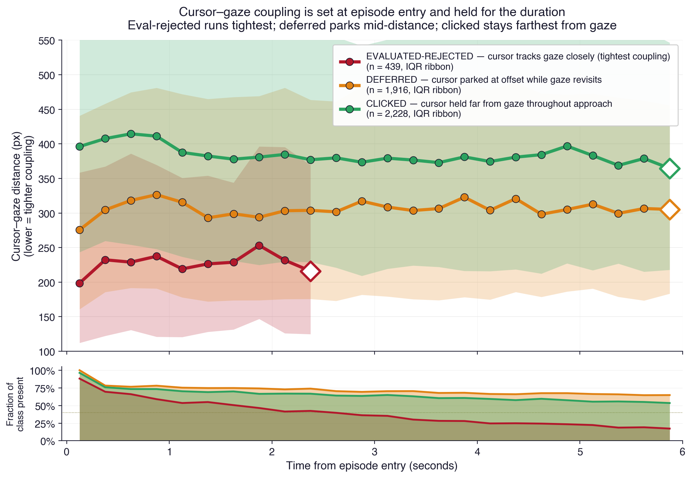
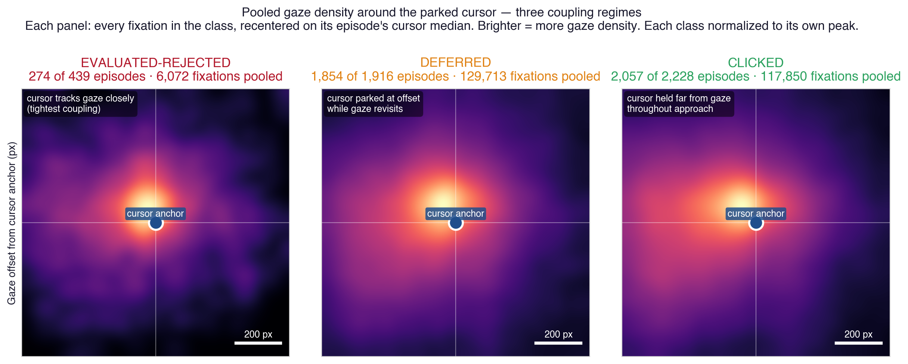
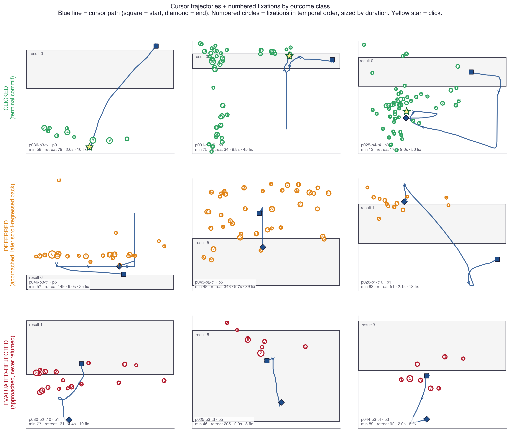
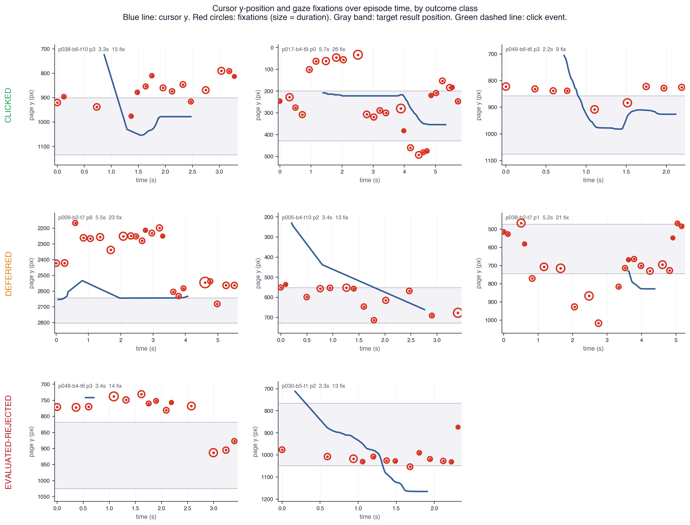
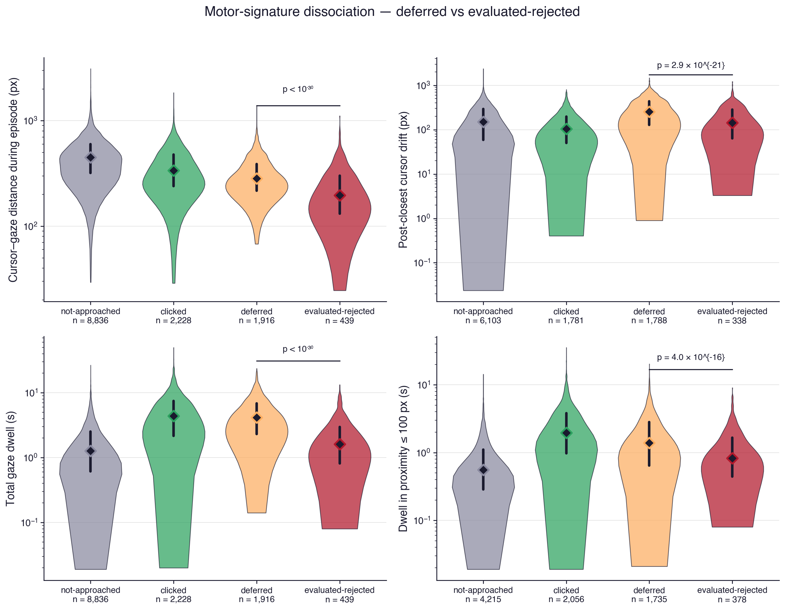
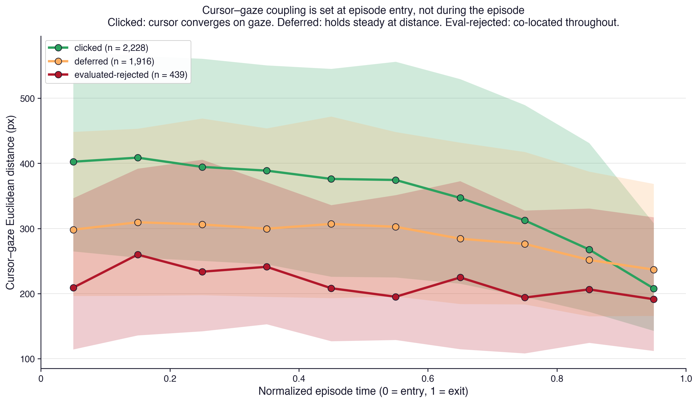
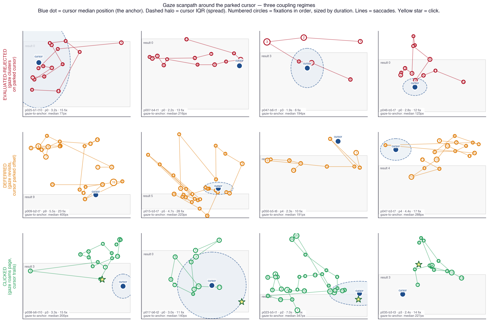

# Figure index — scripts/output/figures/

Canonical visualizations for the approach-retreat / attentional-foraging work.
Each entry records the source script, the creation timestamp, and the intent
(what question the figure answers). Update this file whenever a new figure
lands here.

---

## Canonical

### coupling_traces.png

**Source:** `scripts/render_coupling_traces.py`  ·  **Created:** 2026-04-14
**Stats dump:** [`coupling_traces_summary.json`](coupling_traces_summary.json)

Per-class cursor–gaze distance vs time from episode entry. Median + IQR
ribbon for each of the three outcome classes. Duration truncation via 40 %
min_frac — eval-rejected visibly ends at ~2.5 s while clicked/deferred
run the full 6 s. Sample-count strip below shows the decay of each class
through its episode-time window.

Three flat horizontal bands — eval-rejected ≈ 220 px, deferred ≈ 300 px,
clicked ≈ 390 px — support the "coupling set at episode entry, held for
the duration" mechanism claim.

---

### gaze_density_class.png

**Source:** `scripts/render_gaze_density.py`  ·  **Created:** 2026-04-14
**Stats dump:** [`gaze_density_class_summary.json`](gaze_density_class_summary.json)

Tobii-style gaze density pooled over every episode in each class,
recentered on the episode's cursor-median anchor. Three panels, duration-
weighted, per-class normalized so the spatial pattern reads even when
absolute counts differ. Pooled sample counts are honest: 274 / 439
eval-rejected episodes, 1 854 / 1 916 deferred, 2 057 / 2 228 clicked
(some episodes too sparse to build density from).

The spatial flipside of `coupling_traces.png`: eval-rejected has the
tightest hot core around the cursor, clicked the most diffuse. ±600 px
window, 12 px bins, σ = 3 Gaussian smoothing.

---

## Secondary / retired

| Thumbnail | File | Source | Created | Intent |
|---|---|---|---|---|
|  | `cursor_gaze_array.png` | `scripts/render_cursor_gaze_array.py` | 2026-04-14 | Spatial-trajectory 3×3 grid of individual episode exemplars — blue cursor path + numbered fixation circles sized by duration. *Superseded* for the main narrative by `gaze_density_class.png` because exemplar variance drowns the population pattern; retained for illustrative use. |
|  | `cursor_gaze_timeseries.png` | `scripts/render_cursor_gaze_timeseries.py` | 2026-04-14 | Time-aligned view — cursor-y vs time with fixation events overlaid. Companion to `cursor_gaze_array.png`. |
|  | `deferred_vs_rejected_four_panel.png` | `scripts/render_deferred_vs_rejected.py` | 2026-04-14 | Four-panel violin/swarm contrasting deferred vs evaluated-rejected on motor-signature metrics (`min_dist`, `retreat_dist`, `total_dwell`, duration). Aggregate view of the hard-negative contrast. |
|  | `deferred_vs_rejected_trajectory.png` | `scripts/render_deferred_vs_rejected.py` | 2026-04-14 | Aggregate cursor-to-target-band distance trajectory, deferred vs evaluated-rejected, time-from-entry. Precursor to `coupling_traces.png`. |
|  | `gaze_around_cursor.png` | `scripts/render_gaze_around_cursor.py` | 2026-04-14 | *Retired exemplar variant.* 3×4 grid of per-episode gaze scanpaths anchored on the cursor's median position with dashed IQR halo. Attempted to show the spatial pattern at the exemplar level but individual variance obscured it. Kept for reference; `gaze_density_class.png` is the correct aggregate form. |

---

## Metric provenance

Three different cursor-gaze coupling scalars circulate the repo. They are all computed on the same population but answer slightly different questions. **Don't cite them side-by-side without saying which is which.**

| Where | Aggregation | Reference frame | clicked | deferred | eval-rej |
|---|---|---|---|---|---|
| [`scripts/output/followup_peter_leif/summary.json`](../../followup_peter_leif/summary.json) | median of per-episode medians | cursor at fixation timestamp | **306** | **283** | **197** |
| `gaze_density_class_summary.json` → `median_of_episode_medians` | same | same | 338 | 284 | 214 |
| `coupling_traces_summary.json` → per-bin `median_px` (median of medians-per-episode within each bin) | median-of-per-bin-medians | cursor at fixation timestamp | ~381 | ~305 | ~229 |
| `gaze_density_class_summary.json` → `pooled_fixation_median` | pooled raw fixations | same | 351 | 302 | 251 |

**Rule of thumb for the paper:** cite the **followup_peter_leif** median as the canonical coupling number (`clicked 306 / deferred 283 / eval-rej 197 px`). The coupling_traces figure shows a bin-equal-weighted curve that runs higher because binning lets long-tail episodes push the per-bin medians up. The gaze_density heatmap visualizes the pooled-fixation distribution, not the median-of-medians, so its hot cores look slightly wider than the coupling scalar would suggest.

The gaze_density summary also exposes both aggregations explicitly — use `median_of_episode_medians` if you need to quote from it; `pooled_fixation_median` matches what the heatmap renders.

## Conventions

- **Class colors:** eval-rejected = `#b2182b` (red), deferred = `#e08214` (orange), clicked = `#2ca25f` (green). Consistent across every figure.
- **Coordinate system:** all px values are page-space (document coordinates; mouse-y already includes scroll offset — see `notebooks-v2/data_loader.py` docstring).
- **Contrast:** every figure passes 8:1 WCAG on text elements; decorative elements ≥ 55/255 against background.
- **Stats dumps:** canonical figures write a `*_summary.json` next to the PNG — machine-readable config + per-class stats so papers and downstream tools can cite numbers without re-running the script. Match the filename pattern `<figure>_summary.json`.
- **Caches:** figures that loop every record cache intermediates next to this INDEX (`per_record_fixation_traces.json`, `per_record_gaze_offsets.json`). These are gitignored — delete and re-render if upstream data changes.

## When to touch

- New canonical figure: add a gallery section (thumbnail + source + intent + summary.json link), re-run the script so the summary regenerates.
- Exploratory variant: add a row to the **Secondary / retired** table with intent stated plainly; mark as *Retired* or *Superseded* when a stronger version lands.
- Upstream data changes (features JSON, regression labels): delete the per-record caches, re-render the canonical figures, update timestamps, commit PNG + PDF + summary.json together.
