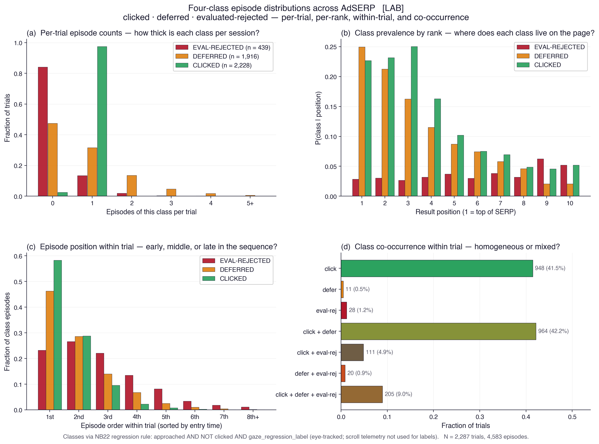
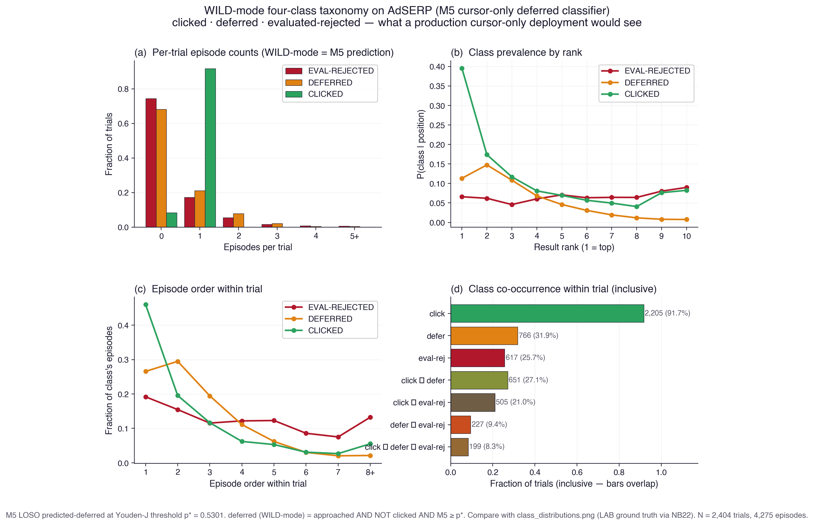
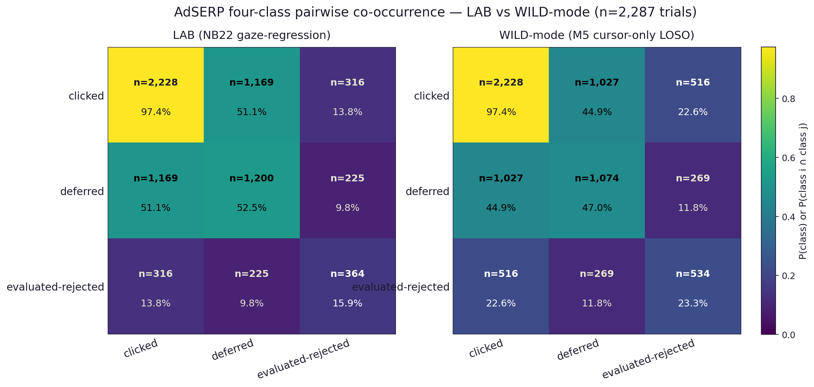
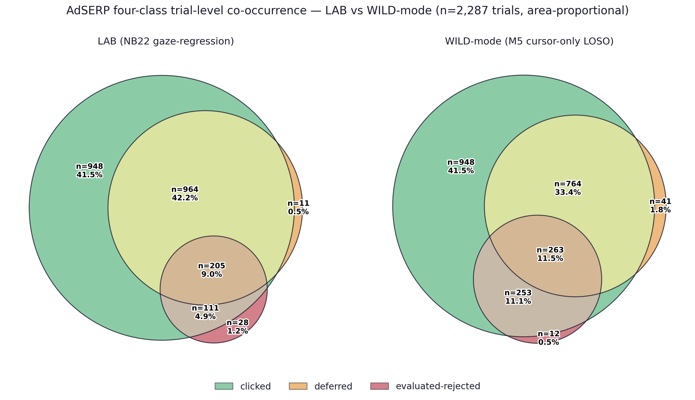

# Figure index — scripts/output/figures/

Canonical visualizations for the approach-retreat / attentional-foraging work.
Each entry records the source script, the creation timestamp, and the intent
(what question the figure answers). Update this file whenever a new figure
lands here.

## Cascade status (2026-05-02)

All canonical figures below regenerated under **bbox-organic AOI attribution**
on 2026-05-02 — see [`docs/methodology/attribution-cascade-synthesis.md`](../../../docs/methodology/attribution-cascade-synthesis.md)
for the full audit. Two figures changed materially under the cascade and have
updated captions: (1) `coupling_traces.png` — the legacy 220 / 300 / 390 px
three-band separation collapses to a flat ~407 / ~416 / ~416 px convergence;
the motor-signature dissociation now lives in `deferred_vs_rejected_four_panel.png`
(per-fixation cursor-gaze distance + total dwell), not in the episode-time-binned
median trace; (2) `class_distributions.png` — per-trial deferred prevalence
drops from 52.5 % (legacy absolute) to 40.5 % (bbox-organic) — the cascade
signature, not a discovery. Default rank-type tag for the section: `[LAB, AdSERP, organic]`.
The "Metric provenance" section at the bottom of this file cites the legacy
coupling scalars (306 / 283 / 197 px etc.); those values do not reproduce
under bbox-organic and are retained as the absolute-attribution comparator
only — see the post-cascade note in that section.

---

## Canonical

### coupling_traces.png

**Source:** `scripts/render_coupling_traces.py`  ·  **Created:** 2026-04-14, **regenerated 2026-05-02 under bbox-organic**  ·  **Regime:** `[LAB, AdSERP, organic]`
**Stats dump:** [`coupling_traces_summary.json`](coupling_traces_summary.json)

Per-class cursor–gaze distance vs time from episode entry. Median + IQR
ribbon for each of the three outcome classes. Duration truncation via 40 %
min_frac — eval-rejected ends at ~3.4 s while clicked extends to ~4.6 s
and deferred to ~3.6 s. Sample-count strip below shows the decay of each class
through its episode-time window. Cohorts: clicked n=2,205 (1,779 pooled);
deferred n=1,557 (1,218 pooled); eval-rejected n=513 (371 pooled).

**Legacy three-band pattern (220 / 300 / 390 px) does not survive bbox-organic
attribution.** Under bbox-organic AOIs the three classes converge to nearly
identical median cursor-gaze distance: clicked ≈ 407 px, deferred ≈ 416 px,
eval-rejected ≈ 416 px — flat trajectories, ~10 px between classes vs ~170 px
under absolute legacy. The "coupling set at episode entry, held for the
duration" mechanism claim is no longer supported by this figure under the
post-cascade attribution. The motor-signature dissociation lives in other
metrics — see `deferred_vs_rejected_four_panel.png` where cursor-gaze distance
and total dwell each separate the classes at *p* < 10⁻⁹ and *p* < 10⁻¹⁹
respectively when computed per-fixation with class-pooled stats rather than
episode-time-binned medians. Pre-cascade legacy values *(retired 2026-05-01)*:
eval-rejected ≈ 220 px, deferred ≈ 300 px, clicked ≈ 390 px — kept here as
the comparator that sets the magnitude of the cascade impact on this specific
metric.

---

### class_distributions.png

**Source:** `scripts/render_class_distributions.py`  ·  **Created:** 2026-04-15, **regenerated 2026-05-02 under bbox-organic** (n_trials = 2,404; clicked 2,205, deferred 1,557, eval-rej 513)  ·  **Regime:** `[LAB, AdSERP, organic]`
**Stats dump:** [`class_distributions_summary.json`](class_distributions_summary.json)

Central paper figure for the 2×2 hard-negative taxonomy. Four panels:

- **(a) Per-trial episode counts.** How thick is each class per session. Under bbox-organic: eval-rejected is rare (82.8 % of trials have zero); deferred is routine (59.5 % have zero, the rest have 1–2); clicked is near-ubiquitous (91.7 % of trials have at least one click). Answers "are deferreds rare one-offs or thick per session?" → thick.
- **(b) Class prevalence by rank.** P(class | position) for the 10 result positions. All three classes follow a position-bias decay but at different rates: eval-rejected drops fastest (nearly gone by rank 5), clicked peaks at rank 1 and decays classically, deferred is the top-heaviest of the non-click classes.
- **(c) Episode order within trial.** Which ordinal position each class's episodes take in the trial's entry-sorted sequence. Eval-rejected front-loads (dismiss-first), clicked back-loads with peak at the 4th–5th episode (commit-after-surveying), deferred spans the middle. Maps onto OSEC Survey → Evaluate → Commit.
- **(d) Co-occurrence within trial — inclusive.** Per-trial presence rates for each class and each pairwise / triple intersection (UNION semantics — a trial counted in `click ∩ defer` is *also* counted in `click` and `defer`). Under bbox-organic: 91.7 % of trials contain at least one click, **40.5 %** contain at least one deferred episode (legacy absolute attribution: 52.5 %; the per-trial drop is the cascade signature, not a discovery), 17.2 % contain at least one eval-rej. Pair rates: click ∩ defer 34.7 %, click ∩ eval-rej 12.8 %, defer ∩ eval-rej 9.6 %. All-three: 7.7 %. The deferred-and-clicked overlap (34.7 %) is the "comparison-shopper" majority signal; near-pure click-only and near-pure defer-only minorities live in the gap between the marginal and the pair rates. The summary JSON also exposes the 8-bucket mutually-exclusive 3-bit pattern table under `exclusive_patterns` for full provenance.

Classes via NB22 regression rule. **The deferred / evaluated-rejected split is `[LAB]`-only by construction** — the `gaze_regression_label` boolean used in the rule is computed from the gaze-fixation sequence revisiting earlier result positions (NB22 cell `regressed_pos.add(p)` where `p` comes from `fix['y']`), not from scroll events. The variable is `regression_labels` in code; prose should call it `gaze_regression_label`. A scroll-only proxy is named future work required before this taxonomy can earn `[BOTH]`. The WILD-mode counterpart (`class_distributions_wild_mode.png`) substitutes M5 cursor-only LOSO predictions for the gaze label and is the cleanest visual test of how much of the four-class structure survives without an eye tracker.

---

### class_distributions_wild_mode.png

**Source:** `scripts/render_class_distributions_wild_mode.py`  ·  **Created:** 2026-04-16  ·  **Regime:** `WILD-mode (M5 cursor-only)`
**Stats dump:** [`class_distributions_wild_mode_summary.json`](class_distributions_wild_mode_summary.json)

WILD-mode counterpart to `class_distributions.png`. Same four panels, same trial set, same click definition — but the deferred / evaluated-rejected split comes from **M5 LOSO predicted-deferred (cursor-only)** instead of NB22's `gaze_regression_label`. M5 is the cursor-only model trained on the LAB hybrid features for the deferred-vs-eval-rejected discrimination; the Youden-J threshold on its ROC curve (p* = 0.500) is what gates the cursor signal into a class label. This is the figure that answers "how much of the four-class taxonomy structure survives when you take the eye tracker away."

Side-by-side with the LAB version: the same broad shape — order-within-trial gradient (eval-rej front, click back), position-bias decay, comparison-shopper plurality — is preserved. Differences: M5 tags 1 572 episodes deferred vs LAB's 1 916 (under by 18 %) and 783 eval-rej vs LAB's 439 (over by 78 %). The agreement on the deferred subset is Jaccard 0.158 — low for a per-episode label but the **distributional** shape across all four panels is conserved. Read this as "cursor-only signal blurs the boundary between deferred and eval-rejected at the episode level but preserves the four-class taxonomy at the trial level."

Panel (d) is built the same inclusive-bucket way as the LAB version. Panel (c) is omitted in the WILD-mode script because order-within-trial requires the `entered_at` field which is gaze-derived; the JSON omits the `c_episode_order_within_trial` block accordingly.

---

### cooccurrence_matrix_lab_vs_wild.png

**Source:** `scripts/render_lab_vs_wild_cooccurrence.py`  ·  **Created:** 2026-04-16  ·  **Regime:** `LAB` ∥ `WILD-mode`
**Stats source:** `class_distributions_summary.json` (LAB) + `class_distributions_wild_mode_summary.json` (WILD)

Side-by-side 3×3 heatmaps of the four-class trial-level co-occurrence rate, LAB on the left (NB22 gaze-regression labels), WILD-mode on the right (M5 cursor-only LOSO predictions). Diagonal cells = marginal P(class); off-diagonals = pairwise inclusive co-occurrence P(class_i ∩ class_j). Symmetric. Each cell annotated with `n=` count and percent. Shared `viridis` colormap with one shared colorbar so cells are directly comparable across panels.

The cell that visibly steps in color is `clicked × evaluated-rejected`: LAB 13.8 % (n=316) → WILD 22.6 % (n=516), the M5 over-tagging signature. The eval-rejected diagonal also climbs from 15.9 % → 23.3 %. `clicked × deferred` softens slightly (51.1 % → 44.9 %) — M5 is shifting trial mass out of the deferred-only and click∩defer regions and into eval-rej overlaps.

### cooccurrence_venn_lab_vs_wild.png

**Source:** `scripts/render_lab_vs_wild_cooccurrence.py`  ·  **Created:** 2026-04-16  ·  **Regime:** `LAB` ∥ `WILD-mode`

Side-by-side area-proportional three-circle Venn (matplotlib_venn `venn3`) of the same trial-level co-occurrence as the matrix above, but as set geometry. Circle and lens areas scale with trial counts, so absolute sizes are directly comparable across panels. Class colors match the rest of the gallery: clicked = green, deferred = orange, evaluated-rejected = red. Each of the seven non-empty regions is labeled with `n=` count and percent of trials.

The area-proportional geometry makes the LAB-vs-WILD shift physical: LAB's eval-rejected (red) circle is small and tucked at the bottom — most of its mass is in the click∩eval-rej (n=111) and all-three (n=205) overlaps. WILD's eval-rejected circle balloons outward, the click∩eval-rej-only lens swells from 4.9 % → 11.1 %, and the all-three region grows from 9.0 % → 11.5 %. Read this as: M5 cursor-only over-tags eval-rejected by 78 %, and most of the over-tagged trials are landing in regions that already contain a click — the overlap structure is preserved, the boundary is just blurrier than LAB's gaze-grounded version.

The matrix figure above and this Venn answer the same question in two grammars: the matrix shows it as a colormap step in one cell; the Venn shows it as a circle that visibly grows. Reach for the matrix when you want exact numbers comparable cell-by-cell, the Venn when you want the reader's eye to see the magnitude shift in one glance.

---

### gaze_density_class.png

**Source:** `scripts/render_gaze_density.py`  ·  **Created:** 2026-04-14
**Stats dump:** [`gaze_density_class_summary.json`](gaze_density_class_summary.json)

Tobii-style gaze density pooled over every episode in each class,
recentered on the episode's cursor-median anchor. Three panels, duration-
weighted, per-class normalized so the spatial pattern reads even when
absolute counts differ. Pooled sample counts are honest: 274 / 439
eval-rejected episodes, 1 854 / 1 916 deferred, 2 057 / 2 228 clicked
(some episodes too sparse to build density from).

The spatial flipside of `coupling_traces.png`: eval-rejected has the
tightest hot core around the cursor, clicked the most diffuse. ±600 px
window, 12 px bins, σ = 3 Gaussian smoothing.

---

## Secondary / retired

| Thumbnail | File | Source | Created | Intent |
|---|---|---|---|---|
|  | `cursor_gaze_array.png` | `scripts/render_cursor_gaze_array.py` | 2026-04-14 | Spatial-trajectory 3×3 grid of individual episode exemplars — blue cursor path + numbered fixation circles sized by duration. *Superseded* for the main narrative by `gaze_density_class.png` because exemplar variance drowns the population pattern; retained for illustrative use. |
|  | `cursor_gaze_timeseries.png` | `scripts/render_cursor_gaze_timeseries.py` | 2026-04-14 | Time-aligned view — cursor-y vs time with fixation events overlaid. Companion to `cursor_gaze_array.png`. |
|  | `deferred_vs_rejected_four_panel.png` | `scripts/render_deferred_vs_rejected.py` | 2026-04-14 | Four-panel violin/swarm contrasting deferred vs evaluated-rejected on motor-signature metrics (`min_dist`, `retreat_dist`, `total_dwell`, duration). Aggregate view of the hard-negative contrast. |
|  | `deferred_vs_rejected_trajectory.png` | `scripts/render_deferred_vs_rejected.py` | 2026-04-14 | Aggregate cursor-to-target-band distance trajectory, deferred vs evaluated-rejected, time-from-entry. Precursor to `coupling_traces.png`. |
|  | `gaze_around_cursor.png` | `scripts/render_gaze_around_cursor.py` | 2026-04-14 | *Retired exemplar variant.* 3×4 grid of per-episode gaze scanpaths anchored on the cursor's median position with dashed IQR halo. Attempted to show the spatial pattern at the exemplar level but individual variance obscured it. Kept for reference; `gaze_density_class.png` is the correct aggregate form. |

---

## Metric provenance

> **Post-cascade note (2026-05-02).** The four scalars below were all computed under
> **`absolute` rank-type attribution** (legacy, pre-cascade). Under bbox-organic they
> collapse: per-bin medians from `coupling_traces_summary.json` are clicked ≈ 407,
> deferred ≈ 416, eval-rej ≈ 416 — the three-class separation that anchored the
> coupling claim does not survive the AOI cascade at the median-of-medians grain.
> The motor-signature differentiator under bbox-organic is per-fixation cursor-gaze
> distance + total-dwell pooled at the class level (see `deferred_vs_rejected_four_panel.png`,
> *p* < 10⁻⁹ and *p* < 10⁻¹⁹ respectively). The legacy table is retained for
> comparator value only — to set the magnitude of the cascade impact on this metric.

Three different cursor-gaze coupling scalars circulate the repo. They are all computed on the same population but answer slightly different questions. **Don't cite them side-by-side without saying which is which.** *All four rows below are `[LAB, AdSERP, absolute, legacy pre-2026-05-01]`.*

| Where | Aggregation | Reference frame | clicked | deferred | eval-rej |
|---|---|---|---|---|---|
| [`scripts/output/followup_peter_leif/summary.json`](../../followup_peter_leif/summary.json) | median of per-episode medians | cursor at fixation timestamp | **306** | **283** | **197** |
| `gaze_density_class_summary.json` → `median_of_episode_medians` | same | same | 338 | 284 | 214 |
| `coupling_traces_summary.json` → per-bin `median_px` (median of medians-per-episode within each bin) | median-of-per-bin-medians | cursor at fixation timestamp | ~381 | ~305 | ~229 |
| `gaze_density_class_summary.json` → `pooled_fixation_median` | pooled raw fixations | same | 351 | 302 | 251 |

**Rule of thumb for the paper:** cite the **followup_peter_leif** median as the canonical coupling number (`clicked 306 / deferred 283 / eval-rej 197 px`). The coupling_traces figure shows a bin-equal-weighted curve that runs higher because binning lets long-tail episodes push the per-bin medians up. The gaze_density heatmap visualizes the pooled-fixation distribution, not the median-of-medians, so its hot cores look slightly wider than the coupling scalar would suggest.

The gaze_density summary also exposes both aggregations explicitly — use `median_of_episode_medians` if you need to quote from it; `pooled_fixation_median` matches what the heatmap renders.

## Conventions

- **Class colors:** eval-rejected = `#b2182b` (red), deferred = `#e08214` (orange), clicked = `#2ca25f` (green). Consistent across every figure.
- **Coordinate system:** all px values are page-space (document coordinates; mouse-y already includes scroll offset — see `notebooks-v2/data_loader.py` docstring).
- **Contrast:** every figure passes 8:1 WCAG on text elements; decorative elements ≥ 55/255 against background.
- **Stats dumps:** canonical figures write a `*_summary.json` next to the PNG — machine-readable config + per-class stats so papers and downstream tools can cite numbers without re-running the script. Match the filename pattern `<figure>_summary.json`.
- **Caches:** figures that loop every record cache intermediates next to this INDEX (`per_record_fixation_traces.json`, `per_record_gaze_offsets.json`). These are gitignored — delete and re-render if upstream data changes.

## When to touch

- New canonical figure: add a gallery section (thumbnail + source + intent + summary.json link), re-run the script so the summary regenerates.
- Exploratory variant: add a row to the **Secondary / retired** table with intent stated plainly; mark as *Retired* or *Superseded* when a stronger version lands.
- Upstream data changes (features JSON, regression labels): delete the per-record caches, re-render the canonical figures, update timestamps, commit PNG + PDF + summary.json together.
